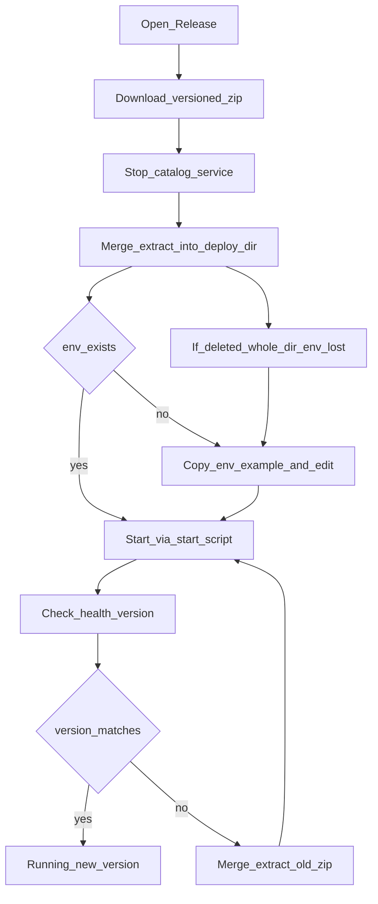
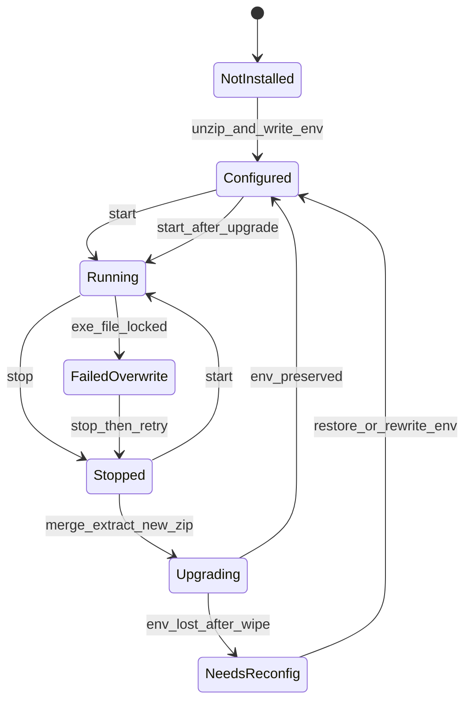

# PRD: 便携包升级与版本化产物命名

| 项 | 内容 |
|---|---|
| 状态 | 工程：partial（见文末「工程验收状态」） |
| 范围 | Win/Mac 便携 zip 发版与现场升级；不改索引业务逻辑 |
| 关联文档 | `docs/workflows/portable-dist-ci.md`、`upgrades/README.md`、`README.md`、`scripts/packaging/build_portable.py`、`.github/workflows/release-portable.yml` |
| 父/相关 | `docs/prd-material-tags-catalog-service.md`（产品总览，非正式 specs PRD） |

## 1. 背景与问题

### 1.1 现状

- 发版走 Git tag（`vX.Y.Z`）→ CI 打 Win/Mac 便携 zip → 挂到 GitHub Release。
- 程序内 `__version__` 已由 CI 从 tag 注入，与 Release / `/health.version` 一致。
- 发布产物文件名与包内顶层目录名为固定形态：`material-tags-catalog-{os}-{arch}`，**不含版本号**。
- 现场升级在 Windows 上通常只能「整包覆盖 / 合并解压」；运维担心覆盖会冲掉已配置的 `.env`（`CATALOG_ROOT`、`HOST`/`PORT` 等）。

### 1.2 要解决的问题

1. **配置保全**：明确升级时 `.env` 会不会被覆盖，以及安全升级步骤（产品约定 + 文档）。
2. **产物可辨识**：从安装包文件名即可区分是哪个 tag 对应的版本，无需打开包或猜 Release 页。

### 1.3 价值假设

为素材机运维降低升级误操作与下错包的成本；发版人继续只打对的 tag，命名与版本由流水线与约定自动对齐。

## 2. 目标与非目标

### 2.1 目标（MVP / Release 0）

- 约定并文档化：**发布包永不包含 `.env`**；原地**合并解压**保留现场 `.env`。
- zip 与包内顶层目录均带 SemVer：`material-tags-catalog-{version}-{os}-{arch}`。
- `{version}` 与 Git tag（去 `v`）及包内 `__version__` 一致。
- 同步更新发版/同事用法文档与 FAQ。

### 2.2 非目标

- 不做自动更新器、MSI/安装器、差分包。
- 不做 `upgrade.bat` / `upgrade.command` 等升级辅助脚本。
- 不把用户 `.env`（或含密钥的配置）打进发布包。
- 不回溯改写历史 Release（如已发布的 `v0.1.0`）附件文件名。
- 不改变索引业务、HTTP API、契约字段。
- 不自造独立包管理系统；命名对齐业界便携分发惯例（如 GoReleaser：`{name}-{version}-{os}-{arch}`）。

## 3. 术语

| 术语 | 含义 |
|---|---|
| 便携包 | PyInstaller onedir + 启动脚本的 zip，无需本机 Python |
| 合并解压 | 解压到已有目录，同名文件被 zip 内文件覆盖；zip 中不存在的文件（如现场 `.env`）保留 |
| 整夹替换 | 删除整个部署目录后再解压，或清空目标后再解压 |
| SemVer / `{version}` | `X.Y.Z`；由 tag `vX.Y.Z` 去掉前缀 `v` 得到 |
| 部署实例 | 某台机器上解压后的一份运行目录 |

## 4. 已拍板规则 / 取舍

| 主题 | 决议 | 说明 |
|---|---|---|
| 升级体验 | **原地合并解压** | 停服务 → 合并解压新包 → 保留 `.env` → 启动验 `version` |
| ENV 进包 | **禁止** | 包内仅 `.env.example`；用户 `.env` 只存在于现场 |
| 危险操作 | **禁止作为推荐路径** | 删整目录 / 清空目标后再解压会导致 `.env` 丢失 |
| 产物命名 | zip **与** 顶层目录均带版本 | 例：`material-tags-catalog-0.2.0-windows-amd64.zip` → 同名目录 |
| 版本真相 | Git tag | 与现有 `_version.py` CI 注入一致；禁止手改入库版本号 |
| 平台范围 | Win 与 Mac **同规则** | 不单开 Windows 特例 |
| 升级脚本 | **本期不做** | 文档 SOP 足够；脚本列入非目标 |
| 历史附件 | **不回溯改名** | 新规则自本能力落地后的下一 tag 起生效 |

## 5. 用户与角色

| 角色 | 目标 |
|---|---|
| 素材机运维（主） | 升级不丢配置；凭文件名选对版本 |
| 发版人 / 开发 | 打 tag 即得到带版本号的 zip；文档与 CI 一致 |
| Agent / 调用方（次） | `/health.version` 与包名、tag 可对照排障 |

## 6. 功能域

| 域 | 产品要求 | 工程落点（指引） |
|---|---|---|
| 命名 | 构建时用注入后的 `__version__`（或等价）生成包名与 zip 名 | `scripts/packaging/build_portable.py` |
| CI 产物 | artifact / Release 附件名与 zip 名一致、可区分版本 | `.github/workflows/release-portable.yml` |
| 文档 | 发版说明、同事三步、升级 SOP、ENV 保全说明 | `docs/workflows/portable-dist-ci.md`、`README.md`、包内 `README.txt` |
| FAQ | 「覆盖升级会不会丢掉 ENV」一篇 | `docs/faqs/`（新建）并登记 `docs/doc_index.md` |
| 配置契约 | 维持「包根 `.env` → 启动复制到 exe 旁」 | 现有 `start.bat` / `start.command`；无需为升级改逻辑 |

## 7. 用户故事地图与版本切片

### 7.1 旅程主干

| 步骤 | 节点 | 说明 |
|---|---|---|
| 1 | Entry | 运维打开 GitHub Releases，按平台选 zip |
| 2 | 识别版本 | 从文件名读出 `{version}`，与目标 tag 对照 |
| 3 | 停服务 | 结束正在运行的 `catalog-service` |
| 4 | 合并解压 | 解压到**同一部署目录**（或覆盖同名顶层目录内容）；不删整夹 |
| 5 | 确认配置 | 确认包根仍有现场 `.env`；`.env.example` 可被新版本覆盖 |
| 6 | 启动 | 双击 `start.bat` / `start.command` |
| 7 | 验活 | `/health` 或 `--version` 与下载版本一致 |
| 8 | Exit | 服务常驻；异常则停服务、恢复备份 zip/`.env` 或重配 |

**Teardown / 逆向**：升级失败 → 停进程 → 用旧版 zip 合并解压回退 → 确认 `.env` 仍在 → 启动。

### 7.2 用户故事地图

#### 阶段 A：获取正确版本

| 故事 | 验收要点 |
|---|---|
| 作为运维，我想要从文件名看出版本，以便不下错包 | Release 附件名为 `material-tags-catalog-{version}-{os}-{arch}.zip`；同一 Release 下 Win/Mac 可区分且均含同一 `{version}` |
| 作为发版人，我想要打 tag 后产物自动带该版本，以便不必手改文件名 | tag `v0.2.0` → `{version}=0.2.0`；与包内 `__version__` 一致 |

#### 阶段 B：安全升级

| 故事 | 验收要点 |
|---|---|
| 作为运维，我想要原地覆盖升级后 `.env` 仍在，以便不必重配素材盘路径 | 官方 SOP 明确：合并解压；zip 不含 `.env`；FAQ 写明「会不会丢 ENV」的答案与例外 |
| 作为运维，我想要知道何种操作会丢配置，以便避开 | 文档明确禁止删整目录/清空后再解压；说明此类操作需事先备份 `.env` |
| 作为运维，我想要升级后确认跑的是新版本，以便排障 | 启动后 `/health.version`（或 `--version`）等于文件名中的 `{version}` |

#### 阶段 C：文档与协作

| 故事 | 验收要点 |
|---|---|
| 作为同事，我想要 README / 便携分发文档与真实附件名一致，以便按文档操作 | `README.md`、`docs/workflows/portable-dist-ci.md`、包内 `README.txt` 中的示例文件名含版本占位或示例版本 |
| 作为开发，我想要 FAQ 可检索「覆盖 ENV」，以便重复问答有据 | `docs/faqs/` 有对应篇，且已写入 `docs/doc_index.md` |

### 7.3 Release 切片

#### Release 0（必选 · MVP）

| 做 | 可验收结果 |
|---|---|
| 版本化 zip + 包内顶层目录命名 | 构建产物符合 `material-tags-catalog-{version}-{os}-{arch}` |
| CI artifact / Release 附件同步 | 发版后 Releases 页可凭文件名区分版本与平台 |
| 升级 SOP + ENV 保全约定写入文档 | portable-dist-ci / README / 包内 README 含升级步骤与禁令 |
| FAQ：覆盖升级与 ENV | 一篇 FAQ；索引已登记 |

**Release 0 不做**：升级脚本、自动更新、历史 Release 改名。

#### Release 1（可选 · 同 PRD 增强）

| 本期做 | 本期不做 |
|---|---|
| 包内更易见的版本展示（如 README.txt 印出构建版本，或旁路 `VERSION` 文本文件） | 图形化升级向导 |
| `workflow_dispatch` 试打包产物名带可辨识版本（如 `0.0.0+ci.<sha>` 的安全文件名形态） | 差分更新 / 安装器 |
| 文档中对「旧无版本文件名」的兼容提示（仅说明历史包可能无版本后缀） | 强制迁移旧部署目录结构的工具 |

## 8. 核心流程与状态机图

### 8.1 升级主流程（Flowchart）

### 8.2 部署实例状态图（State Diagram）

**死胡同预警**：`NeedsReconfig` 若无备份且运维不记得 `CATALOG_ROOT`，无法自动恢复——文档须强调升级前可选手动备份 `.env`，以及禁止整夹删除。

## 9. 数据与 API 衔接

| 项 | 说明 |
|---|---|
| 版本字段 | 已有：`__version__`、`--version`、`GET /health` 的 `version`；本 PRD 不新增 API |
| 配置 | 继续包根 `.env`；启动脚本复制到 `catalog-service/.env` |
| 包结构（目标） | `material-tags-catalog-{version}-{os}-{arch}/` 内含 `README.txt`、`.env.example`、`start.*`、`catalog-service/`、`build-catalog/` |
| 发版说明 | 仍用 `upgrades/vX.Y.Z.md` 作为 Release 正文；与 zip 名中的 `{version}` 对应 |

工程实现时需改动（本 PRD 不落地代码）：`build_portable.py` 包名逻辑、CI artifact 命名、相关文档与 FAQ。

## 10. 假设与待确认 / 开放项

| ID | 内容 | 默认假设 |
|---|---|---|
| O1 | 部分解压工具「清空目标目录再解压」会删掉 `.env` | FAQ/SOP 警示；推荐资源管理器合并解压或等价「不删未打包文件」行为 |
| O2 | 顶层目录带版本后，每次升级目录名变化，是否仍「原地」 | 运维可将新 zip **内容**合并进**固定路径**的既有部署目录；或每次解压到新目录并手动拷贝 `.env`——推荐前者并在文档写清 |
| O3 | Windows 文件占用导致覆盖失败 | SOP：必须先停服务 |
| O4 | `+` 等字符出现在 `workflow_dispatch` 版本时的 zip 文件名合法性 | R1 处理；R0 仅正式 tag SemVer `X.Y.Z` |
| O5 | 与总览草稿 PRD 的关系 | 本文件为正式 specs PRD；总览文档不替代本切片 |

## 11. 成功标准（可度量）

- 任意正式 tag 发版后，Release 上 Win/Mac 两个 zip 文件名均包含该 tag 对应的 `{version}`。
- 按 SOP 合并解压升级：升级前后包根 `.env` 内容不变（字节级或关键键 `CATALOG_ROOT`/`PORT` 不变）。
- 新同事仅凭文件名能说出「这是哪个版本、哪个平台」而无需解压。
- FAQ + 工作流文档可回答「覆盖会不会丢掉 ENV」且与实现一致。

## 12. 风险与缓解

| 风险 | 缓解 |
|---|---|
| 运维习惯删目录再解压 | 文档/FAQ 醒目禁令 + 建议升级前复制一份 `.env` |
| 目录名含版本导致「盖错路径」 | SOP 写明：合并进当前正在用的部署目录，勿依赖目录名等于固定字符串 |
| CI 漏改 artifact 名仍无版本 | Release 0 验收检查附件名 |

## 13. 修订记录

| 日期 | 说明 |
|---|---|
| 2026-07-29 | 初稿：拍板 1A（合并解压保全 ENV、无升级脚本）+ 2A（zip 与目录均带 SemVer）；Release 仅 0/1 |

## 14. 工程验收状态

> 由 `/team:prd-accept` 维护；勿手工编造「通过」。最后更新：2026-07-29T03:33:44Z，main@1639e68，范围：R0,R1。
> 注：R0 实现主要在工作区未提交改动中取证（相对 1639e68）。

### 总览

| 项 | 值 |
|---|---|
| 工程状态 | `partial` |
| 验收判定 | R0 全部通过；R1 三项仍缺，故不能标 `accepted` |
| 最近验收 | 2026-07-29T03:33:44Z |
| 代码提交 | main@1639e68（工作区含 R0 改动） |
| 摘要 | ① zip/目录名已带 `{version}`；② CI artifact 与 zip basename 对齐；③ 升级 SOP + ENV FAQ 已落地；④ R1 包内 VERSION/安全文件名/`+` 清洗与旧包名兼容提示未做；⑤ pytest 12 passed |

### Release 交付

| Release | 状态 | 说明 |
|---|---|---|
| Release 0 | 通过 | 版本化命名、CI 同步、升级 SOP、FAQ 均有仓库证据 |
| Release 1 | 未实现 | 可选增强三项均未交付（见清单 R1-*） |

### 功能验收清单（Agent 优先读此表）

| ID | 能力摘要 | Release | 状态 | 证据 |
|---|---|---|---|---|
| R0-A1 | 从文件名读出版本与平台 | R0 | 通过 | `scripts/packaging/build_portable.py` `package_basename`；`README.md` / `portable-dist-ci.md` 示例名含 `{version}` |
| R0-A2 | tag 注入版本自动进包名且与 `__version__` 一致 | R0 | 通过 | CI `write_version.py` → `_read_package_version()` → `package_basename`；`tests/scripts/packaging/test_build_portable_naming.py` |
| R0-B1 | 合并解压保全 `.env`；zip 不含 `.env` | R0 | 通过 | 构建仅拷 `.env.example`；`docs/workflows/portable-dist-ci.md`「原地升级」；`docs/faqs/portable-upgrade-preserves-env.md` |
| R0-B2 | 文档禁令：删整目录/清空再解压会丢配置 | R0 | 通过 | 同上 SOP/FAQ 禁令与备份建议 |
| R0-B3 | 升级后用 `/health.version` 或 `--version` 核对 | R0 | 通过 | SOP/包内 `README.txt` 写明验活；既有 `/health` 与 `--version`（本 PRD 不新增 API） |
| R0-C1 | README / portable-dist-ci / 包内 README 示例含版本 | R0 | 通过 | `README.md`、`docs/workflows/portable-dist-ci.md`、`scripts/packaging/assets/README.txt` |
| R0-C2 | FAQ「覆盖会否丢 ENV」+ `doc_index` | R0 | 通过 | `docs/faqs/portable-upgrade-preserves-env.md`；`docs/doc_index.md` 已登记 |
| R0-CI | artifact / Release 附件与版本化 zip 名一致 | R0 | 通过 | `.github/workflows/release-portable.yml`「Resolve artifact name」用 zip basename；Release 挂 `upload/*.zip` |
| R1-1 | 包内更易见版本（README 印出版本或 `VERSION` 文件） | R1 | 未实现 | 包内 `README.txt` 无构建版本占位；无旁路 `VERSION` 文件生成 |
| R1-2 | `workflow_dispatch` 产物安全文件名（处理 `+` 等） | R1 | 未实现 | 当前仍用原始 `0.0.0+ci.<sha>` 进文件名（可辨识已随 R0 有，但 O4/R1「安全形态」未做） |
| R1-3 | 文档提示历史无版本文件名兼容 | R1 | 未实现 | `docs/` 无「旧包可能无版本后缀」说明 |

### 未完成与遗留

- R1：包内版本可见性（`VERSION` / README 印版）。
- R1：`+` 等字符的 zip/artifact 安全文件名清洗（O4）。
- R1：历史无版本附件/目录名的文档兼容提示。
- 现场「合并解压后 `.env` 字节级不变」依赖真实发版/人工按 SOP 验收；本仓无端到端解压取证（属约定+文档，非自动化缺口阻塞 R0 判定）。
- R0 改动尚未 commit；下一正式 tag 起附件名才在 GitHub Releases 上可凭文件名验收。

### 质量检查

| 检查项 | 状态 |
|---|---|
| `.venv/bin/python -m pytest -q` | 通过（12 passed） |
| （无） | — |
| 文档与 OpenAPI 同步 | 通过（本 PRD 不改 API；workflow/README/FAQ/包内 README 已对齐版本化命名与升级 SOP） |

---
统计：通过 8 / 部分 0 / 未实现 3 / 范围外 0
