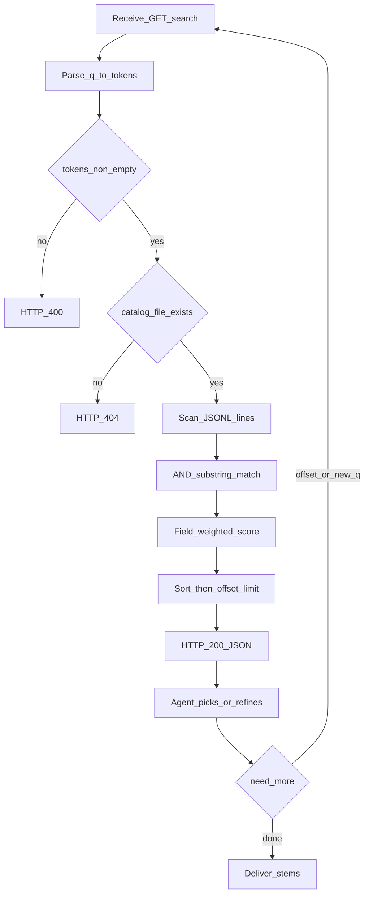
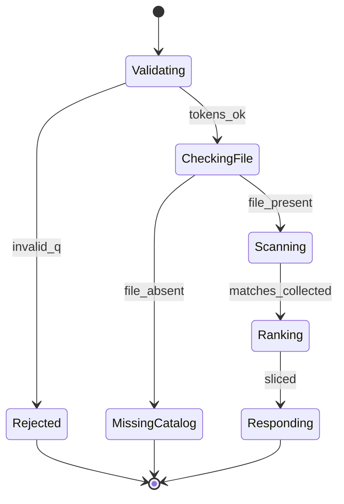

# PRD: Catalog 关键词检索（供 Agent 找素材）

| 项 | 内容 |
|---|---|
| 状态 | 工程：accepted（见文末「工程验收状态」） |
| 范围 | 本仓 HTTP 增加轻量关键词 search；读现有 JSONL；不改打标契约字段 |
| 关联文档 | `docs/contracts/material-tags-catalog.md`、`docs/workflows/serve-catalog-service.md`、`src/catalog_service/api.py`、`docs/prd-material-tags-catalog-service.md`（总览 F16） |
| 父/相关 | 总览草稿 F16「查询辅助」；`specs/prds/prd-00001-portable-upgrade-versioning.md`（无关升级，仅序号相邻） |

## 1. 背景与问题

### 1.1 现状

- 本仓将素材盘上 `*.material-tags.json` 合并为 `material-tags-catalog.jsonl`，经 `GET /v1/catalog` 流式全量返回。
- Agent / 大模型原设计为拉全量后再自行挑选；素材量已接近**成百上千**，全量塞进上下文浪费 token，且易漏检（lost-in-the-middle）。
- 总览草稿已将 `GET /v1/catalog/search?q=` 标为 P1（F16），尚未落地。

### 1.2 要解决的问题

1. **服务端先筛**：按关键词返回少量候选行，模型只读 top K 再精选 `stem` / 路径。
2. **避免「永远同一批前 20」**：不能仅按文件物理顺序先到先得截断；需**加权排序** + **`offset` 分页**，并返回 `total_matched` 便于改写查询或翻页。
3. **保持轻量**：不上向量 RAG、不上独立搜索集群、不引入 SQLite FTS；继续以 JSONL 为唯一正式索引源。

### 1.3 价值假设

找素材主路径变为「构造 `q` → search → 精选」后，千级库仍可用；本仓边界仍是贴着素材盘的索引服务，而非知识库产品。

## 2. 目标与非目标

### 2.1 目标（MVP / Release 0）

- 提供 **`GET /v1/catalog/search`**：查询参数 `q`、`limit`、`offset`。
- 每次请求读取当前 catalog JSONL，多词 **AND** + 子串匹配 `title` / `description` / `keywords`。
- **字段加权打分**后稳定排序，再按 `offset`+`limit` 切片；响应含 `total_matched` 与完整 catalog 行列表。
- 契约/workflow/OpenAPI 可验收；关键路径有 pytest。

### 2.2 非目标

- 向量检索 / RAG / embedding / 独立「知识库」产品。
- SQLite FTS5 或其他旁路全文引擎（本期明确不做；性能不够时另开 PRD）。
- 同义词表、拼音、错别字纠错、结果多样性（MMR）算法。
- 改打标上游字段契约；改 JSONL 行 schema（search 只读现有行）。
- 管理 UI；多 root / 多 catalog 命名空间。
- `POST` 检索体；按 `stem` 精确点查的专用接口（可列开放项）。
- R0 鉴权、内存常驻整表缓存（与现网全量读接口一致：search 亦不强制鉴权）。

## 3. 术语

| 术语 | 含义 |
|---|---|
| catalog 行 | JSONL 中一行，字段见 `docs/contracts/material-tags-catalog.md` |
| 正式索引源 | 磁盘上的 `material-tags-catalog.jsonl`（或 `CATALOG_OUT`）；search 只读它 |
| 查询词 token | 由 `q` 按空白与中英文逗号拆出的非空片段 |
| AND | 每个 token 都必须在行的可检索文本中子串命中 |
| 加权分 | 按命中落在 keywords / title / description 累加的排序分；R0 **不**在响应中暴露 |
| top K | 排序后经 `offset` 跳过再取 `limit` 条 |

## 4. 已拍板规则 / 取舍

| 主题 | 决议 | 说明 |
|---|---|---|
| HTTP 方法 | **GET** | 幂等读查询；Agent/curl 友好；`q` 短，无需 POST body |
| 数据源 | 每次请求读 JSONL | 无 FTS、无常驻内存索引（R0） |
| 分词 | 空白、`,`、`，` | 去空 token；无 token → 4xx |
| 匹配 | 子串包含 | 可检索串 = title + description + keywords；英文字段匹配时可对 haystack/needle 做 casefold |
| 多词 | **AND** | 全部 token 命中才入候选 |
| 计分 | keywords +3 / title +2 / description +1 | 每个 token 在对应字段出现则加该字段权重（同一 token 多字段可叠加按实现约定写清：推荐每字段最多计一次该 token） |
| 排序 | 分降序，同分 `stem` 升序 | 稳定、可测 |
| 分页 | `limit` 默认 20，硬上限 100；`offset` 默认 0 | 先全量计匹配再排序切片（千～万级可接受） |
| 响应分数字段 | **不返回 score** | 避免调用方依赖未承诺的分制 |
| 坏行 | 跳过无法解析的行 | 不因单行损坏导致整个 search 500 |
| catalog 缺失 | 与全量接口一致：404 | 文件不存在则不可搜 |
| 与 rebuild 并发 | 读当前文件快照语义 | 允许读到重建中的旧/新文件；不强事务 |

## 5. 用户与角色

| 角色 | 目标 |
|---|---|
| 剪辑/运营（经 Agent） | 用口语需求快速落到少量候选素材 |
| Agent / 大模型 | 调 search，只消化 K 条，再输出 stem / tags_path / media_guess |
| 运维 | curl 验收；无新中间件、无新库文件 |
| 开发 | 纯函数可测的分词/计分/排序；API 薄封装 |

## 6. 功能域

| 域 | 产品要求 | 工程落点（指引） |
|---|---|---|
| 检索核心 | 分词、AND 子串、加权、排序、切片 | 新建如 `src/catalog_service/search.py`（名可调整） |
| HTTP | `GET /v1/catalog/search` | `src/catalog_service/api.py` |
| 契约/文档 | 查询参数与响应 JSON；Agent 两段式用法 | `docs/contracts/` 或 serve workflow 增节；`docs/doc_index.md` 登记变更 |
| 测试 | 分词/计分/排序/API 空结果与缺文件 | `tests/` 镜像路径 |

## 7. 用户故事地图与版本切片

### 7.1 旅程主干

| 步骤 | 节点 | 说明 |
|---|---|---|
| 1 | Entry | 用户提出找素材需求（或运维 curl 试搜） |
| 2 | 构造 q | Agent 提炼关键词写入 `q`（可多词逗号/空格） |
| 3 | 调用 search | `GET /v1/catalog/search?q=…&limit=…&offset=…` |
| 4 | 读候选 | 模型阅读 `items`；参考 `total_matched` |
| 5 | 精选 | 输出 1～N 个 stem 及路径字段 |
| 6 | 分支 | 若不满意：收窄/换词再搜，或增大 `offset` 翻页 |
| 7 | Exit | 交付素材定位；或确认无合适素材 |

**Teardown / 逆向**：0 命中 → 改写 `q` 或结束；404 catalog 缺失 → 先 rebuild / 检查 `CATALOG_ROOT`；`q` 非法 → 修正参数。

### 7.2 用户故事地图

#### 阶段 A：检索可达

| 故事 | 验收要点 |
|---|---|
| 作为 Agent，我想要用 GET 按关键词搜 catalog，以便不必拉全量 | 存在 `GET /v1/catalog/search`；`q` 必填；返回 JSON 含 `items` |
| 作为调用方，我想要一次只要前 K 条，以便控制上下文 | 默认 `limit=20`；超过上限被钳制或 4xx（实现选定一种并文档写死；推荐钳制到 100） |
| 作为调用方，我想知道一共命中多少，以便决定是否翻页或改词 | 响应含 `total_matched`（排序前的命中总数） |

#### 阶段 B：排序与翻页公平

| 故事 | 验收要点 |
|---|---|
| 作为用户，我不希望「衣帽」永远只能看到文件最前面的 20 条 | 结果按加权分排序，而非文件原始顺序先到先得截断 |
| 作为 Agent，我想要看下一批命中，以便翻找 | 支持 `offset`；`offset=20&limit=20` 与第一页不重复（在数据不变时） |
| 作为开发，我想要同分结果稳定，以便测试不 flaky | 同分按 `stem` 升序 |

#### 阶段 C：异常与协作

| 故事 | 验收要点 |
|---|---|
| 作为调用方，空关键词时应得到明确错误 | `q` 缺失或拆完无 token → 400 |
| 作为调用方，无命中时应得到空列表而非 500 | `items=[]`，`total_matched=0`，HTTP 200 |
| 作为运维，catalog 不存在时应可区分 | 404，与 `GET /v1/catalog` 语义一致 |
| 作为开发，我想要文档说明与模型的两段式配合 | serve workflow（或契约）写明：先 search 再精选；可用 offset / 改 q |

### 7.3 Release 切片

#### Release 0（必选 · MVP）

| 做 | 可验收结果 |
|---|---|
| GET search + 参数校验 | curl / OpenAPI 可调；非法 `q` → 400 |
| AND 子串 + 字段加权排序 + limit/offset | 单测覆盖计分与分页；手工用例「多词 AND」「翻页不重复」 |
| 响应 JSON 约定 | 含 `query`、`tokens`、`limit`、`offset`、`total_matched`、`items` |
| 缺文件 / 坏行 | 404；坏行跳过 |
| 文档 | `docs/workflows/serve-catalog-service.md`（及契约或 API 节）更新；`docs/doc_index.md` 如有新/改摘要则登记 |

**Release 0 不做**：OR 模式、score 字段、内存缓存、鉴权、FTS、Agent 示例长文案（可放 R1）。

#### Release 1（可选 · 同 PRD 增强）

| 本期做 | 本期不做 |
|---|---|
| Agent 调用示例（workflow / `/docs` 说明：构造 q → search → 精选 → 可选 offset） | 向量 / FTS / 同义词 |
| 可选：响应增加 `skipped_bad_lines` 计数 | OR 开关（若未来需要另议；默认保持 AND） |
| 英文 casefold 行为在文档中写死 | 强制迁移调用方改用 search、废弃全量 GET |

## 8. 核心流程与状态机图

### 8.1 检索主流程（Flowchart）



### 8.2 一次 search 请求视角（State Diagram）



**死胡同预警**：`MissingCatalog` 不能靠 search「造」索引——须走既有 rebuild / 启动 build；文档须指向 `POST /v1/catalog/rebuild` 与配置检查。

## 9. 数据与 API 衔接

### 9.1 请求

| 参数 | 类型 | 默认 | 说明 |
|---|---|---|---|
| `q` | string | （必填） | 原始查询串 |
| `limit` | int | 20 | 1～100；超出上限钳制到 100（推荐）或 400，实现与文档一致即可 |
| `offset` | int | 0 | ≥0；超过命中数则 `items=[]` |

### 9.2 响应（200）

```json
{
  "query": "玄关,衣帽架",
  "tokens": ["玄关", "衣帽架"],
  "limit": 20,
  "offset": 0,
  "total_matched": 83,
  "items": [
    {
      "stem": "C0300",
      "tags_path": "…",
      "media_guess": null,
      "schema_version": "1",
      "generated_at": "…",
      "title": "…",
      "description": "…",
      "keywords": "…"
    }
  ]
}
```

`items[]` 字段与 catalog 行契约一致；**不含** `score`。

### 9.3 错误

| 情况 | HTTP |
|---|---|
| `q` 缺失 / 无有效 token / `offset` 非法等 | 400 |
| catalog 文件不存在 | 404 |

### 9.4 与现有 API 关系

| 接口 | 继续用途 |
|---|---|
| `GET /v1/catalog` | 全量导出、备份、小库调试；**找素材主路径改为 search** |
| `GET /v1/catalog/meta` | 规模与 mtime |
| `POST /v1/catalog/rebuild` | 保证 JSONL 新鲜后再搜 |

## 10. 假设与待确认 / 开放项

| ID | 内容 | 默认假设 |
|---|---|---|
| O1 | 同一 token 在多字段命中时分如何累加 | 每字段对该 token 最多加一次对应权重 |
| O2 | `limit>100` | 钳制为 100（优于直接 400，减少 Agent 试错） |
| O3 | 超大 JSONL（十万+）扫全表延迟 | 本期接受；若不足另开 FTS/缓存 PRD |
| O4 | stem 精确查询 | 不在本期；需要时新故事/PRD |
| O5 | search 是否纳入便携包发版说明 | 随实现发版写入 `upgrades/vX.Y.Z.md`，非本 PRD 阻塞 |

## 11. 成功标准（可度量）

- 给定固定测试 JSONL：多词 AND、加权顺序、`offset` 翻页结果与单测金样一致。
- Agent（或人工）仅用 search 返回的 ≤20 条即可完成一次找片演示，无需拉全量。
- `total_matched` 大于 `limit` 时，二次请求增大 `offset` 能拿到不同 `stem`（数据不变前提下）。
- 文档可回答：为何用 GET、如何与模型两段式配合、为何不做 RAG。

## 12. 风险与缓解

| 风险 | 缓解 |
|---|---|
| 子串误伤（短词命中过多） | Agent 改用多词 AND；运维/打标写好 keywords；可看 `total_matched` 收窄 |
| 全表扫描变慢 | R0 接受千～万级；监控耗时；不足另 PRD |
| 调用方仍拉全量 | 文档把 search 标为主路径；示例导向 search |
| 重建中读到半新半旧 | 现有原子 replace 写 JSONL；search 打开当前完整文件 |

## 13. 修订记录

| 日期 | 说明 |
|---|---|
| 2026-07-29 | 初稿：拍板 GET + JSONL 扫表 + AND 子串 + 字段加权 + offset；明确非目标含 RAG/FTS |

## 14. 工程验收状态

> 由 `/team:prd-accept` 维护；勿手工编造「通过」。最后更新：2026-07-29T07:31:34Z，main@436b577+WIP，范围：R0,R1。

### 总览

| 项 | 内容 |
|---|---|
| 工程状态 | accepted |
| 验收判定 | Release 0 与 Release 1 必选条目均通过；可选 `skipped_bad_lines` 未认领标范围外 |
| 最近验收 | 2026-07-29T07:31:34Z |
| 代码提交 | main@436b577 之上工作区未提交（含 `search.py` / API / 测试 / 文档） |

摘要：

1. `GET /v1/catalog/search` 已落地：分词 AND、字段加权排序、`limit` 钳制、`offset` 分页、响应无 score。
2. 纯函数与 API pytest 覆盖分词/计分/翻页/400/404/空命中/OpenAPI。
3. 契约与 serve workflow 已写清匹配规则、casefold、Agent 两段式找素材。
4. R1 可选 `skipped_bad_lines` 未实现，本期未认领。
5. 实现仍在工作区，尚未 `git commit`。

### Release 交付

| Release | 状态 | 说明 |
|---|---|---|
| R0 | 通过 | MVP：search API + 计分排序分页 + 文档/测试 |
| R1 | 通过 | Agent 示例与 casefold 文档写死；可选计数未认领 |

### 功能验收清单（Agent 优先读此表）

| ID | 能力摘要 | Release | 状态 | 证据 |
|---|---|---|---|---|
| R0-01 | `GET /v1/catalog/search`；`q` 必填；非法/无 token → 400 | R0 | 通过 | `src/catalog_service/api.py`；`tests/.../test_api.py`（`test_search_empty_q_400`） |
| R0-02 | 默认 `limit=20`；`>100` 钳制为 100 | R0 | 通过 | `api.py` `_SEARCH_LIMIT_*`；`test_search_limit_clamped` |
| R0-03 | 响应含 `total_matched` + `items` 等约定字段；无 score | R0 | 通过 | `CatalogSearchResponse`；`test_search_ok` |
| R0-04 | AND 子串 + keywords/title/description 加权；分降序 | R0 | 通过 | `src/catalog_service/search.py`；`test_score_and_and_weights`、`test_search_catalog_and_multi_token`、`test_search_catalog_sort_and_paging` |
| R0-05 | `offset` 翻页；同分 `stem` 升序 | R0 | 通过 | `test_search_catalog_sort_and_paging`、`test_search_catalog_tie_break_stem` |
| R0-06 | 无命中 200 空列表；catalog 缺失 404；坏行跳过 | R0 | 通过 | `test_search_no_hit`、`test_search_404_missing_catalog`、`test_search_catalog_skips_bad_lines` |
| R0-07 | OpenAPI 含 search；契约/workflow/`doc_index` 已更新 | R0 | 通过 | `test_openapi_includes_search`；`docs/contracts/material-tags-catalog.md`；`docs/workflows/serve-catalog-service.md`；`docs/doc_index.md` |
| R1-01 | Agent 两段式：构造 q → search → 精选 → offset/改 q | R1 | 通过 | serve workflow「Agent 两段式找素材」；OpenAPI `description` |
| R1-02 | 英文 casefold 行为在文档写死 | R1 | 通过 | serve workflow「匹配与排序」；`api.py` description；`score_record` casefold |
| R1-03 | 可选：响应 `skipped_bad_lines` | R1 | 范围外 | PRD 标注可选，本期未认领；坏行仍静默跳过 |

### 未完成与遗留

- 工作区变更尚未提交（`search.py`、API、测试、文档仍为 WIP）。
- R1 可选 `skipped_bad_lines` 未做；需要可观测坏行数时再补。
- §开放项 O3～O5（超大 JSONL / stem 精确查 / 发版说明）不在本期验收范围。

### 质量检查

| 检查项 | 状态 |
|---|---|
| `.venv/bin/python -m pytest -q` | 通过（29 passed） |
| （无） | — |
| 文档与 OpenAPI 同步 | 通过（workflow/契约/`/openapi.json` 含 search） |

---
统计：通过 9 / 部分 0 / 未实现 0 / 范围外 1
