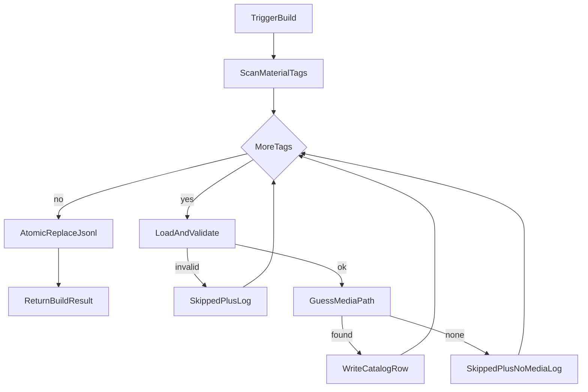
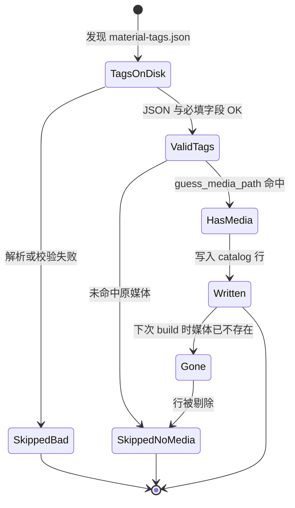

# PRD: 无原媒体则不入索引

| 项 | 内容 |
|---|---|
| 状态 | 工程：`accepted`（见文末「工程验收状态」） |
| 范围 | 写侧 builder：无原媒体不写 catalog 行；契约与测试同步；不改 search 读逻辑 |
| 关联文档 | `docs/contracts/material-tags-catalog.md`、`docs/workflows/build-catalog-once.md`、`docs/workflows/serve-catalog-service.md`、`src/catalog_service/builder.py`、`src/catalog_service/media_guess.py` |
| 父/相关 | `specs/prds/prd-00002-catalog-keyword-search.md`（search 只读现有行；本 PRD 保证入索引的行可落地打开） |

## 1. 背景与问题

### 1.1 现状

- 本仓扫描 `*.material-tags.json`，经 `guess_media_path` 猜测同目录同 stem 媒体，合并写入 `material-tags-catalog.jsonl`。
- 当同目录找不到白名单媒体时，仍写入 catalog 行，且 `media_guess` 为 `null`。
- Agent / 人通过 `GET /v1/catalog/search` 或全量接口可能命中此类行，但无法打开原文件——与「找素材」目标矛盾。

### 1.2 要解决的问题

1. **索引只含可落地素材**：只有标签、没有原媒体的条目不应进入正式索引。
2. **统一写路径**：CLI 一次性 build、watch 触发、定时重建共用同一规则，避免幽灵行反复出现。
3. **可观测**：跳过原因在日志中可区分（无媒体 vs 坏 JSON），`skipped` 计数仍可汇总。

### 1.3 价值假设

找素材闭环是「可搜 → 拿到路径 → 打开原文件」。写侧硬过滤后，检索结果默认都能对应可打开媒体；删原片后下次 rebuild 自然剔除对应行。

## 2. 目标与非目标

### 2.1 目标（MVP / Release 0）

- `build_catalog`：`guess_media_path` 未命中（等价于将写出的 `media_guess is None`）时 **不写行**，`skipped += 1`，打 warning 日志（文案含无媒体原因与 tags 路径）。
- CLI / watch / 定时触发均走同一 builder，行为一致。
- 成功写入的行：`media_guess` 为相对 root 的非空路径（类型声明可仍为 `string | null`，正常写出行应始终有值）。
- 更新契约说明「无原媒体不入索引」；关键路径有 pytest（仅标签无媒体 → 不写入；有媒体 → 仍写入）。

### 2.2 非目标

- search / 全量读接口对历史 `media_guess: null` 行做二次过滤（靠下次 rebuild 清掉）。
- 扩展媒体白名单（如 `.avi`）；跨目录查找原媒体。
- 改上游打标契约字段；专用 orphan 清理 CLI。
- 校验文件可读性、非空、完整性（R0：`Path.is_file()` 存在即算有，沿用现有 `guess_media_path`）。
- 将 `skipped` 拆成多字段 API 响应（可放 Release 1）。
- 管理 UI；多 root。

## 3. 术语

| 术语 | 含义 |
|---|---|
| 原媒体 / 原文件 | 与标签同目录、同 stem、且扩展名落在 `MEDIA_EXTENSIONS` 白名单中的媒体文件（由 `guess_media_path` 判定） |
| 孤儿标签（orphan tags） | 存在 `*.material-tags.json`，但 `guess_media_path` 返回 `None` |
| catalog 行 | JSONL 中一行，字段见 `docs/contracts/material-tags-catalog.md` |
| skipped | `BuildResult.skipped`：本轮未写入的标签条数（含坏 JSON / 校验失败 / 无原媒体） |

## 4. 已拍板规则 / 取舍

| 主题 | 决议 | 说明 |
|---|---|---|
| 检测时机 | **仅 build 写侧** | CLI、watch、定时共用 `build_catalog`；search 不二次过滤 |
| 原文件定义 | **严格复用** `guess_media_path` | 未命中即 skip；不另发明判定 |
| 白名单外扩展名 | 视为无原文件并 skip | 扩白名单另开 PRD |
| skipped 计数 | 与坏 JSON **共用** `skipped` | 日志文案区分 `no media` / 解析失败 |
| 空文件 / 权限 | 存在即算有 | 不深挖可读性或字节数 |
| 删原片后索引 | 下次成功 rebuild 后行消失 | 接受最终一致；网络盘误判靠定时兜底 |
| 契约字段 | 不删 `media_guess` 类型上的 null | 语义改为：正常入索引行应有值；历史/异常行仍可能 null |

## 5. 用户与角色

| 角色 | 目标 |
|---|---|
| Agent / 大模型 | search 命中的行都能落到可打开的 `media_guess` |
| 素材盘运维 / 打标同事 | 删原片后重建索引不再出现废条目；日志能看到被 skip 的标签 |
| 本仓开发 | 规则落在 builder 一处；契约与单测可验收 |
| 上游打标仓 | 仍只写 `*.material-tags.json`；本仓不改打标格式 |

## 6. 功能域

| 域 | 产品要求 | 工程落点（指引） |
|---|---|---|
| 写侧过滤 | 无原媒体不写 JSONL 行 | `src/catalog_service/builder.py`：`catalog_record` 后若 `media_guess is None` → skip |
| 猜媒体 | 行为不变，仅消费结果 | `src/catalog_service/media_guess.py`（R0 不改算法） |
| 可观测 | 日志标明无媒体；`skipped` 累加 | `logger.warning`；`BuildResult` / meta 既有字段 |
| 契约 | 写明无媒体不入索引 | `docs/contracts/material-tags-catalog.md`；实现时更新 `docs/doc_index.md` 摘要如需 |
| 测试 | 有/无媒体对照用例 | `tests/src/catalog_service/test_builder.py` |

## 7. 用户故事地图与版本切片

### 7.1 旅程主干

| 步骤 | 节点 | 说明 |
|---|---|---|
| Entry | 触发 build | CLI / watch / 定时 |
| 1 | 扫描标签 | `iter_material_tags` |
| 2 | 加载校验 | 坏 JSON → SkippedBad |
| 3 | 猜原媒体 | `guess_media_path` |
| 4a | 有媒体 | 写入 catalog 行 |
| 4b | 无媒体 | skip，不写行 |
| 5 | 原子替换 | tmp → 正式 JSONL |
| Exit | 返回 BuildResult | `written` / `skipped` / 日志 |

Teardown：单次 build 结束；无长期会话状态。删原片后依赖下一次 Entry 再次走 4b 剔除旧行。

### 7.2 用户故事地图

**阶段 A — 建索引过滤**

| 故事 | 验收要点 |
|---|---|
| 作为索引服务，我想要在合并 catalog 时跳过无原媒体的标签，以便索引不含打不开的条目 | 仅有 `*.material-tags.json`、无白名单媒体时，该 stem 不出现在输出 JSONL；`skipped >= 1` |
| 作为索引服务，我想要在有原媒体时行为与现网一致，以便不破坏正常素材 | 同目录存在白名单媒体时仍写入，且 `media_guess` 为相对路径非空 |
| 作为运维，我想要在日志里看到因无媒体被跳过的路径，以便排查打标残留 | warning 日志含 tags 路径及无媒体原因（可与「skip …」风格一致） |

**阶段 B — 触发路径一致**

| 故事 | 验收要点 |
|---|---|
| 作为常驻服务，我想要 watch / 定时 rebuild 也应用同一过滤，以便幽灵行不会因触发源不同而残留 | 文档/实现声明三入口均调用同一 `build_catalog`；无单独旁路写 JSONL |

**阶段 C — 检索消费（间接）**

| 故事 | 验收要点 |
|---|---|
| 作为 Agent，我想要在 rebuild 之后 search 不到已无原片的素材，以便不选到废条目 | 先有行后删媒体再 rebuild，该 stem 从 JSONL 消失；R0 **不**要求 search 特判 null |

### 7.3 Release 切片

#### Release 0（MVP，必选）

- builder：`media_guess is None` → 不写行 + `skipped` + 日志。
- 契约文档补充规则；pytest 覆盖有/无媒体。
- **可验收结果**：临时盘上「仅标签」不入索引；「标签+mp4」入索引；`build` 日志与 `skipped` 可观测。

#### Release 1（可选增强）

- `BuildResult` / `/v1/catalog/meta` 区分 `skipped_no_media` 与 `skipped_invalid`（或等价字段）。
- **本期不做**（进非目标，不另开 R2）：search 读侧过滤、扩白名单、跨目录找媒体、orphan 清理 CLI。

## 8. 核心流程与状态机图

### 8.1 Build 主流程（含异常与逆向）

### 8.2 Catalog 条目生命周期

断头路扫描：无「仅标签却长期强制留在索引」的稳态；前提是后续仍有成功 rebuild。网络盘瞬时误判导致误 skip 时，定时重建可纠正（与现网 watch 兜底策略一致）。

## 9. 数据与 API 衔接

| 层 | 变更 |
|---|---|
| 输入标签 | 不变：仍认 `*.material-tags.json` 必填字段 |
| 输出 JSONL | 正常新写出的行应带非空 `media_guess`；不再主动写入「无媒体」行 |
| `BuildResult` | R0：`skipped` 语义扩展为含无媒体；字段结构不变 |
| HTTP search / catalog | R0：**不改**；读当前 JSONL 快照 |
| meta | R0：继续暴露既有 `skipped`；R1 可拆分原因 |

实现时须更新 `docs/contracts/material-tags-catalog.md` 中关于 `media_guess` 与入索引条件的说明。

## 10. 假设与待确认 / 开放项

| 项 | 状态 |
|---|---|
| 检测仅 build；原文件 = `guess_media_path` | **已定**（计划默认，随本 PRD 落盘） |
| 白名单外扩展名本期 skip | **已定** |
| 网络盘误 skip 靠定时重建最终一致 | **已定** / 可接受 |
| 是否需要 R1 分计数 | **开放**：有运维诉求再做 R1 |
| 是否单独 PRD 扩展媒体白名单 | **开放** |
| 历史 JSONL 在升级后、首次 rebuild 前仍可能含 null 行 | **已知**：接受窗口；不强制启动时即时全量 scrub |

## 11. 成功标准（可度量）

1. 构造「仅标签、无白名单媒体」fixture：`build_catalog` 后 JSONL **不含**该 stem；`skipped >= 1`。
2. 构造「标签 + 白名单媒体」：JSONL 含该行且 `media_guess` 非 null。
3. 先写入再删除媒体后再次 build：该 stem **消失**。
4. 契约文档可检索到「无原媒体不入索引」规则说明。

## 12. 修订记录

| 日期 | 说明 |
|---|---|
| 2026-07-30 | 初稿：写侧跳过孤儿标签；R0 builder+契约+测试；可选 R1 分计数 |

## 13. 工程验收状态

> 由 `/team:prd-accept` 维护；勿手工编造「通过」。最后更新：2026-07-30T01:48:52Z，main@b8c51fb（**实现仍在工作区未提交**），范围：R0,R1。

### 总览

| 项 | 内容 |
|---|---|
| 工程状态 | `accepted` |
| 验收判定 | 通过 |
| 最近验收 | 2026-07-30T01:48:52Z |
| 代码基线 | `main@b8c51fb` + 工作区未提交变更（builder / models / state / 契约 / 测试） |
| 摘要 | ① `media_guess is None` 不写行并记 `skipped_no_media`；② 有媒体仍写入；③ 删媒体再 build 行消失；④ R1 meta/BuildResult 拆分 `skipped_no_media` / `skipped_invalid`；⑤ 本地 E2E（`/team:test-enginer`）对真实素材盘验证通过 |

### Release 交付

| Release | 状态 | 说明 |
|---|---|---|
| R0 | 通过 | 写侧过滤 + 契约 + pytest + 三入口共用 `build_catalog` |
| R1 | 通过 | `BuildResult` / `last_build` / rebuild 响应暴露原因拆分字段 |

### 功能验收清单（Agent 优先读此表）

| ID | 能力摘要 | Release | 状态 | 证据 |
|---|---|---|---|---|
| R0-01 | 无原媒体不写 JSONL；`skipped` 累加；warning 含 no media | R0 | 通过 | `src/catalog_service/builder.py`（`media_guess is None` → skip）；`tests/.../test_builder.py::test_build_skips_orphan_tags_without_media` |
| R0-02 | 有白名单媒体时仍写入且 `media_guess` 非空 | R0 | 通过 | `test_build_writes_when_media_present`；`test_build_catalog_atomic_and_skip` |
| R0-03 | 删媒体后再 build，行消失 | R0 | 通过 | `test_build_removes_row_after_media_deleted`；本地 E2E POST `/v1/catalog/rebuild` |
| R0-04 | CLI / watch / 定时 / HTTP 共用同一 builder | R0 | 通过 | `docs/workflows/serve-catalog-service.md`、`build-catalog-once.md`；`api.py`/`service` 调 `build_catalog` |
| R0-05 | 契约写明「无原媒体不入索引」 | R0 | 通过 | `docs/contracts/material-tags-catalog.md`「入索引条件」；`docs/doc_index.md` 摘要 |
| R0-06 | 成功标准 1–4（fixture / 契约可检索） | R0 | 通过 | 同上测试 + 契约检索「无原媒体不入索引」 |
| R1-01 | `skipped_no_media` / `skipped_invalid` 写入 BuildResult 与 meta | R1 | 通过 | `models.BuildResult`；`state.record_build`；`test_api` meta/rebuild 断言；E2E 可区分 invalid vs no_media |
| NX-01 | search 读侧二次过滤历史 null | — | 范围外 | §2.2 非目标 |
| NX-02 | 扩白名单 / 跨目录 / orphan CLI | — | 范围外 | §2.2 非目标 |

### 未完成与遗留

- 实现与本 PRD 文件均尚未 `git commit`；合并前建议提交后把 `accepted_commit` 改为含实现的 commit。
- 历史 JSONL 在升级后首次 rebuild 前仍可能含 `media_guess: null`（PRD 已知窗口，非缺陷）。

### 质量检查

| 检查项 | 状态 |
|---|---|
| `.venv/bin/python -m pytest -q` | 通过（32 passed） |
| （无） | — |
| 文档与 OpenAPI 同步 | 通过（契约 / workflow / doc_index；meta 字段经 HTTP 实测） |

---
统计：通过 7 / 部分 0 / 未实现 0 / 范围外 2
