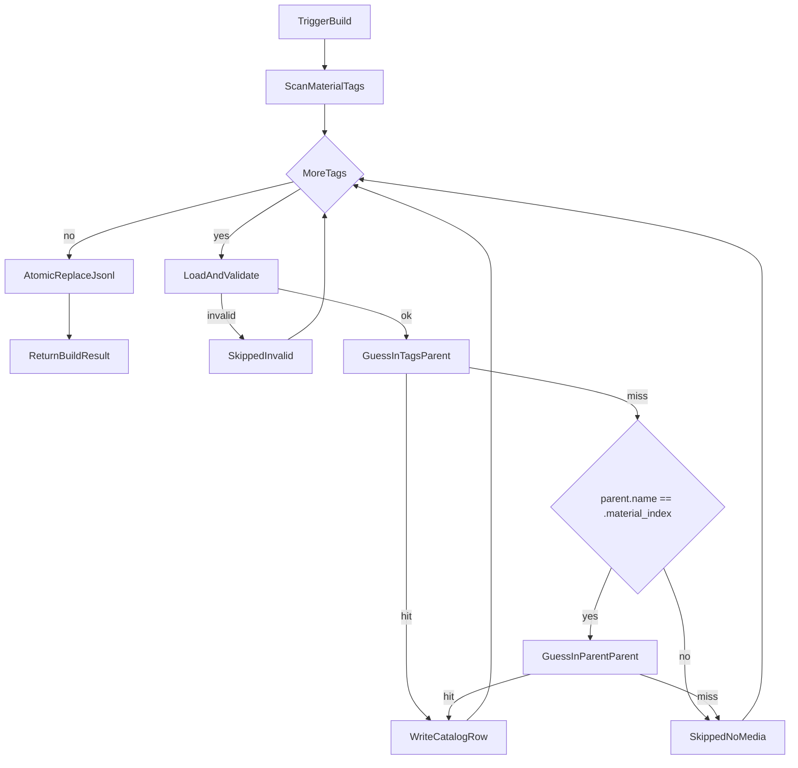
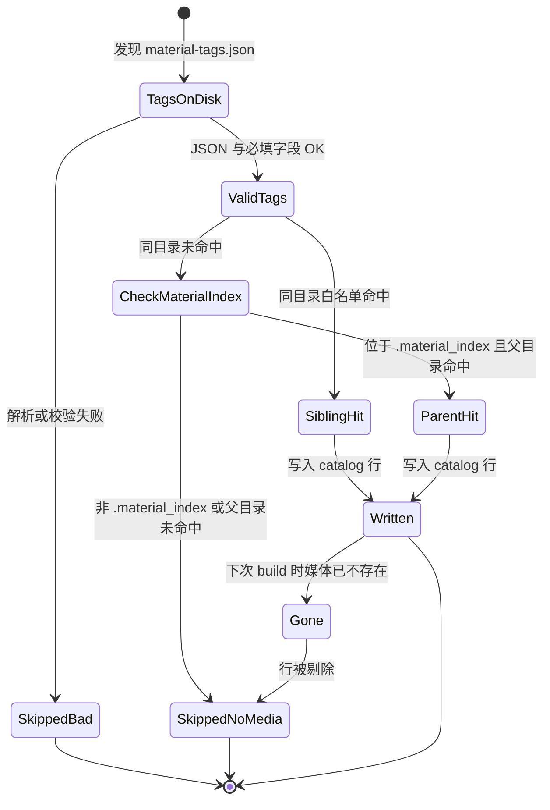

# PRD: `.material_index` 父目录媒体猜测

| 项 | 内容 |
|---|---|
| 状态 | 工程：`accepted`（见文末「工程验收状态」） |
| 范围 | 扩展 `guess_media_path`：`.material_index` 内标签可在直接父目录命中原媒体；契约与单测同步；不改 HTTP search / builder 过滤语义 |
| 关联文档 | `docs/contracts/material-tags-catalog.md`、`docs/workflows/build-catalog-once.md`、`docs/workflows/serve-catalog-service.md`、`src/catalog_service/media_guess.py`、`src/catalog_service/builder.py` |
| 父/相关 | `specs/prds/prd-00003-skip-orphan-tags-without-media.md`（无原媒体不入索引；本 PRD 扩大「猜得到媒体」的路径范围，过滤规则不变） |

## 1. 背景与问题

### 1.1 现状

- 本仓扫描 `**/*.material-tags.json`，经 `guess_media_path` **仅在标签同目录**按白名单猜同 stem 原媒体；未命中则按 prd-00003 **不入索引**（`skipped_no_media`）。
- 上游 / 远程素材盘已出现新布局：已打标媒体仍在业务目录（如 `已打标/`），标签收进其子目录 `.material_index/`：

```text
已打标/
  C0306.mp4
  .material_index/
    C0306.material-tags.json
```

- 测试根目录中新旧布局并存：部分路径仍为「标签与媒体同目录」（如第二天-访谈、混杂）；部分已迁入 `.material_index`（如第一天-逛园区）。

### 1.2 要解决的问题

1. **新布局可入索引**：标签在 `.material_index/`、原片在其直接父目录时，应能猜到媒体并写出非空 `media_guess`。
2. **旧布局不回退**：同目录旁挂标签+媒体的行为与现网一致。
3. **无媒体规则不变**：两处都猜不到 → 仍 skip，不写幽灵行。
4. **契约可检索**：入索引条件从「仅同目录」更新为含 `.material_index` → 父目录规则。

### 1.3 价值假设

找素材闭环仍是「可搜 → 拿到路径 → 打开原文件」。上游集中存放标签后，本仓若不认父目录媒体，新布局会整批 `skipped_no_media`，索引空/残缺；有限上翻（仅 `.material_index` 的直接父目录）即可对齐盘面事实，且避免任意深度上翻误伤。

## 2. 目标与非目标

### 2.1 目标（MVP / Release 0）

- 扩展 `guess_media_path`：
  1. **先**在 `tags_path.parent`（同目录）按既有白名单与 stem 规则查找；
  2. 若未命中，且 `tags_path.parent.name == ".material_index"`，再到 **`tags_path.parent.parent`（直接父目录）** 按同一规则查找；
  3. 其它情况 **不上翻**。
- 成功写入行的 `media_guess` 仍为相对 `CATALOG_ROOT` 的 posix 路径（可指向父目录下的媒体文件）。
- 更新 `docs/contracts/material-tags-catalog.md` 入索引 / `media_guess` 说明；实现时视需要刷新 `docs/doc_index.md` 摘要。
- pytest：同目录命中；`.material_index`+父目录命中；两处皆无 → skip；混合 root 一轮 build 新旧布局均可写入。

### 2.2 非目标

- 任意深度上翻父目录；非 `.material_index` 路径的父目录查找。
- 目录名别名（`Material Index`、`material-index` 等）；本期 **仅**认 `.material_index`。
- catalog JSONL / HTTP 响应新增 `layout` 等字段。
- 布局迁移 CLI（把旧同目录标签搬进 `.material_index`）。
- 改 HTTP search / 全量读逻辑；扩媒体白名单；改上游打标 JSON 字段。
- 校验媒体可读性、非空、完整性（仍：`Path.is_file()` 存在即算有）。
- 管理 UI；多 root。

## 3. 术语

| 术语 | 含义 |
|---|---|
| `.material_index` | 上游约定的标签存放子目录名（精确匹配，含前导点） |
| 同目录布局（旧） | `*.material-tags.json` 与同 stem 白名单媒体位于同一目录 |
| 父目录布局（新） | 标签位于 `…/<dir>/.material_index/<stem>.material-tags.json`，媒体位于 `…/<dir>/<stem>.<ext>` |
| 原媒体 / 原文件 | 由 `guess_media_path` 按本 PRD 规则命中的白名单媒体文件 |
| 孤儿标签 | 存在标签文件但 `guess_media_path` 返回 `None`（入索引条件仍不满足） |
| `MEDIA_EXTENSIONS` | 现有扩展名白名单与优先级（`.mp4` → … → `.mp3`） |

## 4. 已拍板规则 / 取舍

| 主题 | 决议 | 说明 |
|---|---|---|
| 查找顺序 | **同目录优先，再条件性父目录** | 同目录命中即返回；`.material_index` 内误放媒体副本时用同目录的 |
| 父目录触发条件 | **仅当** `parent.name == ".material_index"` | 与测试根 / 远程盘一致；变体名有变再开 |
| 上翻深度 | **仅一层**（`parent.parent`） | 禁止再向上 |
| 无媒体 | **仍 skip** | 复用 prd-00003；builder 过滤语义不变 |
| 白名单与 stem | **复用现有算法** | 扩展名优先级、排除自身标签文件等不变 |
| 目录名常量 | **硬编码 / 常量** `.material_index` | 不配置化（YAGNI）；上游改名则改常量并更新契约 |
| HTTP / 字段 | **不改** | `tags_path` 仍指向标签相对路径；`media_guess` 可为父目录相对路径 |
| 扫描隐藏目录 | **保持** `**/*.material-tags.json` | 应能扫到 `.material_index` 下标签；R0 不另加排除规则 |

## 5. 用户与角色

| 角色 | 目标 |
|---|---|
| 素材盘运维 / 打标同事 | 新 `.material_index` 布局下 rebuild 后索引完整 |
| Agent / 检索消费者 | `media_guess` 仍能打开真实原片 |
| 本仓开发 | 规则集中在 `media_guess`；契约与单测可验收；builder 少动 |
| 上游打标仓 | 可继续写新布局；本仓只适配消费路径 |

## 6. 功能域

| 域 | 产品要求 | 工程落点（指引） |
|---|---|---|
| 猜媒体 | 同目录 + `.material_index`→父目录 | `src/catalog_service/media_guess.py`：`guess_media_path` |
| 写侧过滤 | 未命中仍不写行 | `src/catalog_service/builder.py`（逻辑可不动，只消费新猜测结果） |
| 契约 | 更新入索引条件与 `media_guess` 语义 | `docs/contracts/material-tags-catalog.md`；必要时 `docs/doc_index.md` |
| 测试 | 新旧布局与 skip 对照 | `tests/src/catalog_service/test_builder.py` 或拆 `test_media_guess.py` |
| 可观测（R1） | 日志可区分 sibling / parent 命中 | warning/info 文案；**不**写 layout 字段 |

## 7. 用户故事地图与版本切片

### 7.1 旅程主干

| 步骤 | 节点 | 说明 |
|---|---|---|
| Entry | 触发 build | CLI / watch / 定时 / HTTP rebuild |
| 1 | 扫描标签 | `iter_material_tags`（含 `.material_index` 下文件） |
| 2 | 加载校验 | 坏 JSON → `skipped_invalid` |
| 3 | 猜原媒体 | 同目录 →（若适用）父目录 |
| 4a | 命中 | 写入 catalog 行（`media_guess` 非空） |
| 4b | 未命中 | skip，`skipped_no_media` |
| 5 | 原子替换 | tmp → 正式 JSONL |
| Exit | 返回 BuildResult | `written` / `skipped_*` / 日志 |

Teardown：单次 build 结束。删父目录原片后，下次 Entry 走 4b 剔除旧行。

### 7.2 用户故事地图

**阶段 A — 猜媒体适配新布局**

| 故事 | 验收要点 |
|---|---|
| 作为索引服务，我想要在标签位于 `.material_index` 且父目录有同 stem 媒体时猜中路径，以便新布局能入索引 | fixture：`dir/.material_index/S.material-tags.json` + `dir/S.mp4` → `guess_media_path` 返回该 mp4；build 后 JSONL 含该 stem 且 `media_guess` 指向父目录相对路径 |
| 作为索引服务，我想要继续支持同目录布局，以便未迁移目录不回退 | 标签与 `S.mp4` 同目录时行为与现网一致，写入成功 |
| 作为索引服务，我想要同目录命中优先于父目录，以便 `.material_index` 内误放副本时结果确定 | 同目录与父目录均有同 stem 白名单媒体时，返回同目录路径 |
| 作为索引服务，我想要在两处都无媒体时仍跳过，以便不产生幽灵行 | `.material_index` 下仅有标签、父目录无白名单媒体 → 不写行，`skipped_no_media >= 1` |

**阶段 B — 混合盘面与触发一致**

| 故事 | 验收要点 |
|---|---|
| 作为运维，我想要同一 `CATALOG_ROOT` 下新旧布局一轮 build 都能入库，以便渐进迁移 | 同一 root 内同时放置同目录样本与 `.material_index` 样本，一轮 `build_catalog` 两者均 `written` |
| 作为常驻服务，我想要 CLI / watch / 定时共用同一猜媒体逻辑，以便行为不因入口分裂 | 三入口仍只调 `build_catalog` → `guess_media_path`；无旁路写 JSONL |

**阶段 C — 检索消费（间接）**

| 故事 | 验收要点 |
|---|---|
| 作为 Agent，我想要 search 返回的 `media_guess` 在新布局下仍可打开，以便选片落地 | rebuild 后命中行的 `media_guess` 相对 root 解析为真实文件；R0 **不**改 search API |

### 7.3 Release 切片

#### Release 0（MVP，必选）

- 实现扩展后的 `guess_media_path`（规则见 §4）。
- 契约文案更新；pytest 覆盖：同目录 / `.material_index`+父目录 / 双 miss skip / 混合 root。
- **可验收结果**：对新布局测试根路径 rebuild 后，对应 stem 出现在 JSONL 且 `media_guess` 非空；旧布局回归通过；无媒体仍 skip。

#### Release 1（可选增强）

- 猜中或 skip 相关日志标明命中层级（`sibling` vs `parent`）或等价文案，便于运维排查。
- **本期不做**（进非目标，禁止 R2 占位）：目录名别名、任意上翻、layout 字段、迁移 CLI、扩白名单、改 search。

## 8. 核心流程与状态机图

### 8.1 猜媒体与 Build 主流程



### 8.2 媒体解析结果生命周期（相对单条标签）



断头路扫描：非 `.material_index` 且同目录无媒体 → 明确 skip，不上翻（避免误把无关父目录文件当成原片）。父目录删媒体后依赖下次成功 rebuild 剔除行。网络盘瞬时不可见靠定时重建纠正。

## 9. 数据与 API 衔接

| 层 | 变更 |
|---|---|
| 输入标签 | 不变：仍认 `*.material-tags.json` 与必填字段 |
| `guess_media_path` | **行为扩展**（本 PRD 核心） |
| 输出 JSONL | 字段集合不变；新布局下行的 `tags_path` 含 `.material_index/…`，`media_guess` 指向父目录媒体相对路径 |
| `BuildResult` / meta | R0 不变；无媒体仍走既有 `skipped_no_media` |
| HTTP search / catalog | R0：**不改** |

实现时须更新契约中「同目录」表述为含 `.material_index` 父目录规则。

## 10. 假设与待确认 / 开放项

| 项 | 状态 |
|---|---|
| 查找规则 A；目录名仅 `.material_index` | **已定** |
| 旧同目录布局继续支持；同目录优先 | **已定** |
| 非 `.material_index` 不上翻；HTTP/字段不改 | **已定** |
| 上游目录名若变更 | **开放**：用户另行通知后改常量与契约 |
| `.material_index` 下是否出现更深子目录嵌套 | **开放**：本期只认「标签的直接 parent 名为 `.material_index`」；更深嵌套需另议 |
| R1 日志标明 sibling/parent | **开放**：有运维诉求再做 |

## 11. 成功标准（可度量）

1. fixture：`.material_index` + 父目录 mp4 → build 写入该 stem，`media_guess` 相对路径解析存在且指向父目录文件。
2. fixture：同目录标签+媒体 → 回归通过（写入且路径正确）。
3. fixture：`.material_index` 仅标签、父目录无白名单媒体 → JSONL 无该 stem，`skipped_no_media >= 1`。
4. fixture：同一 root 混合新旧布局 → 一轮 build 两者均写入。
5. 契约可检索到 `.material_index` / 父目录猜测规则说明。

## 12. 修订记录

| 日期 | 说明 |
|---|---|
| 2026-07-30 | 初稿：`.material_index` 父目录媒体猜测；R0 media_guess+契约+测试；可选 R1 命中层级日志 |

## 13. 工程验收状态

> 由 `/team:prd-accept` 维护；勿手工编造「通过」。最后更新：2026-07-30T06:51:43Z，main@afc48b0（**实现仍在工作区未提交**），范围：R0,R1。

### 总览

| 项 | 内容 |
|---|---|
| 工程状态 | `accepted` |
| 验收判定 | 通过 |
| 最近验收 | 2026-07-30T06:51:43Z |
| 代码基线 | `main@afc48b0` + 工作区未提交变更（`media_guess.py` / 契约 / workflow / `doc_index` / 测试） |
| 摘要 | ① `.material_index`→直接父目录猜媒体；② 同目录优先；③ 双 miss 仍 `skipped_no_media`；④ 混合布局一轮 build；⑤ 真实测试根 E2E + 正式孤儿夹具 `验收夹具/orphan-no-media` |

### Release 交付

| Release | 状态 | 说明 |
|---|---|---|
| R0 | 通过 | `guess_media_path` 扩展 + 契约/workflow + pytest + 真实盘 rebuild/search |
| R1 | 范围外 | 可选增强（sibling/parent 日志）；§10 开放「有运维诉求再做」，本期未认领 |

### 功能验收清单（Agent 优先读此表）

| ID | 能力摘要 | Release | 状态 | 证据 |
|---|---|---|---|---|
| R0-01 | `.material_index` + 父目录同 stem 媒体 → 猜中并写入 | R0 | 通过 | `src/catalog_service/media_guess.py`；`test_guess_media_in_material_index_parent`；E2E：C0306/C0315/C0318 `media_guess` 指向 `已打标/<stem>.mp4` |
| R0-02 | 同目录布局不回退 | R0 | 通过 | 既有 `test_guess_media_and_catalog_record` / `test_build_writes_when_media_present`；E2E：C0304 等同目录行 |
| R0-03 | 同目录优先于父目录 | R0 | 通过 | `test_guess_media_sibling_preferred_over_parent` |
| R0-04 | 两处皆无媒体 → skip，不写幽灵行 | R0 | 通过 | `test_build_skips_material_index_without_parent_media`；E2E：`验收夹具/orphan-no-media` → `skipped_no_media=1`，JSONL 无 `ORPHAN_NO_MEDIA` |
| R0-05 | 同一 root 混合新旧布局一轮 build 均写入 | R0 | 通过 | `test_build_mixed_layouts_in_one_root`；E2E：rebuild `written=7`（3 新+4 旧） |
| R0-06 | CLI / watch / 定时 / HTTP 共用 `build_catalog`→`guess_media_path` | R0 | 通过 | `builder.py` 唯一写侧；`api`/`service` 调 `build_catalog`；无旁路写 JSONL |
| R0-07 | search 新布局 `media_guess` 可打开；不改 search API | R0 | 通过 | E2E：`GET /v1/catalog/search?q=微笑对镜` → C0306，`tags_path` 含 `.material_index`，父目录 mp4 存在 |
| R0-08 | 契约 / doc_index / build workflow 写明父目录规则 | R0 | 通过 | `docs/contracts/material-tags-catalog.md` 入索引条件；`docs/doc_index.md`；`docs/workflows/build-catalog-once.md` |
| R1-01 | 日志标明 sibling vs parent 命中层级 | R1 | 范围外 | §7.3 可选增强；§10 开放项；本期未认领 |
| NX-01 | 目录名别名 / 任意上翻 / layout 字段 / 迁移 CLI | — | 范围外 | §2.2 非目标 |
| NX-02 | 改 search / 扩白名单 / 媒体可读性校验 | — | 范围外 | §2.2 非目标 |

### 未完成与遗留

- 实现与本 PRD 均尚未 `git commit`；合并前建议提交后把 `accepted_commit` 改为含实现的 commit。
- R1 sibling/parent 命中层级日志未做（开放项，有运维诉求再开）。
- 真实盘正式孤儿夹具：`媒体资源测试根目录/验收夹具/orphan-no-media/`（每次 rebuild 预期 `skipped_no_media>=1`）。

### 质量检查

| 检查项 | 状态 |
|---|---|
| `.venv/bin/python -m pytest -q` | 通过（42 passed） |
| （无） | — |
| 文档与 OpenAPI 同步 | 通过（契约 / build workflow / doc_index；HTTP 行为未改，search 实测仍可用） |

---
统计：通过 8 / 部分 0 / 未实现 0 / 范围外 3
