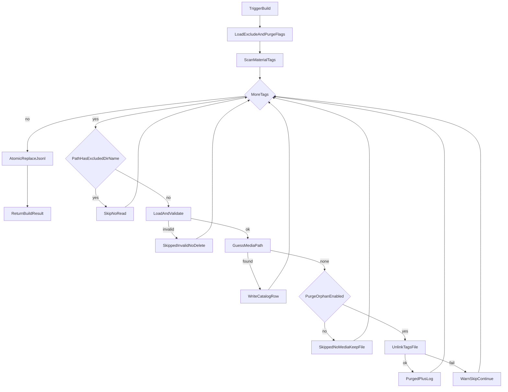
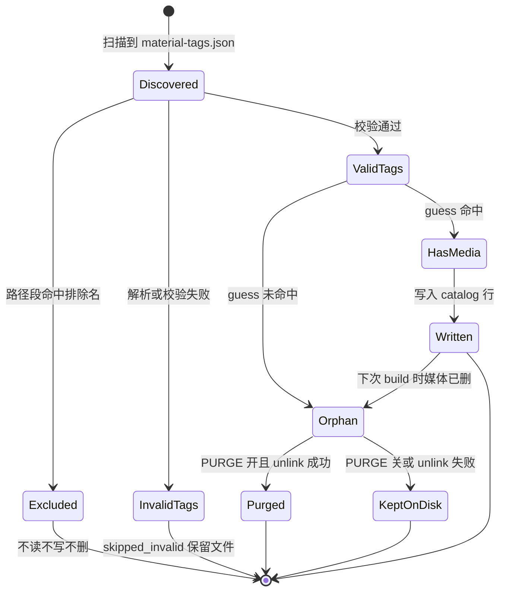

# PRD: 扫描排除 + 清理 orphan 标签

| 项 | 内容 |
|---|---|
| 状态 | 工程：`accepted`（见文末「工程验收状态」） |
| 范围 | 写侧：可配置目录名排除扫描；合法 orphan（校验通过但无原媒体）默认物理删除 `*.material-tags.json`；契约 / `.env.example` / workflow / 测试同步 |
| 关联文档 | `docs/contracts/material-tags-catalog.md`、`docs/workflows/build-catalog-once.md`、`docs/workflows/serve-catalog-service.md`、`.env.example`、`src/catalog_service/builder.py`、`src/catalog_service/config.py` |
| 父/相关 | `specs/prds/prd-00003-skip-orphan-tags-without-media.md`（无原媒体不入索引；本 PRD **追加**盘面 purge，覆盖其「不做 orphan 清理」非目标）；`specs/prds/prd-00004-material-index-parent-media-guess.md`（猜媒体规则不变，仍用 `guess_media_path` 判定 orphan） |

## 1. 背景与问题

### 1.1 现状

- 本仓对 `CATALOG_ROOT` 递归扫描 `**/*.material-tags.json`，经 `guess_media_path` 猜原媒体后写入 `material-tags-catalog.jsonl`。
- **无排除机制**：测试盘上的 `000-回收站` 等目录若含标签/媒体，会被扫进索引，污染检索。
- **prd-00003** 已保证：猜不到原媒体时 **不写 catalog 行**；但盘上旁车 `*.material-tags.json` **仍保留**。用户删了原片 A 后，标签文件可能长期残留，下次 rebuild 只是 skip，不清理盘面。

### 1.2 要解决的问题

1. **可配置目录排除**：按目录名列表跳过任意深度匹配的子树，不扫描、不入索引（示例：`000-回收站`）。
2. **合法 orphan 物理清理**：校验通过但 `guess_media_path` 未命中时，默认 **unlink** 该标签文件，使盘面与「可搜可打开」闭环一致。
3. **统一写路径**：CLI / watch / 定时 / HTTP rebuild 共用同一 `build_catalog` 规则。

### 1.3 价值假设

排除目录避免垃圾区入索引；删片后清旁车减少盘面噪音与误再打标干扰。运维用 `.env` 即可调名单与 purge 开关，无需改代码。

## 2. 目标与非目标

### 2.1 目标（MVP / Release 0）

- 新增 env：`SCAN_EXCLUDE_DIR_NAMES`（逗号分隔目录名）；相对 root 的路径中 **任一路径段精确匹配** 名单 → 该标签 **不扫描/不处理**。
- 空名单 = 不排除；**不**硬编码死名单（文档示例推荐 `000-回收站`）。
- 合法 orphan（JSON/必填字段 OK 且 `media_guess is None`）：默认物理删除标签文件；记日志与计数（R0 至少日志可观测；建议内部 `purged` 计数）。
- env：`PURGE_ORPHAN_TAGS` 默认 `true`；设为 `false` 时行为回退为仅 skip（与 prd-00003 一致），不删文件。
- 坏 JSON / 校验失败：**不删**，仅 `skipped_invalid`。
- unlink 失败：warning 日志，计为 skip，**不中断**整次 build。
- 更新契约、workflow、`.env.example`；pytest 覆盖排除与 purge。

### 2.2 非目标

- 管理 UI；软删 / 移入回收站；按 mtime 宽限期防抖。
- 删除坏 JSON；扩展媒体白名单；改上游打标契约字段。
- 多 root；独立 orphan 清理 CLI（逻辑进 builder 即可）。
- search 读侧二次过滤；改 `guess_media_path` 算法本身。

## 3. 术语

| 术语 | 含义 |
|---|---|
| 排除目录名 | `SCAN_EXCLUDE_DIR_NAMES` 中的精确目录名；命中路径任一段即排除整棵子树内标签 |
| 合法 orphan | 标签文件校验通过，但 `guess_media_path` 返回 `None`（含白名单外扩展名等未命中情形） |
| purge | 对本仓而言：物理 `unlink` 该 `*.material-tags.json` |
| skipped_no_media | 因无原媒体未写入 catalog 的条数（purge 成功与否均可计入；R1 可再拆 `purged`） |

## 4. 已拍板规则 / 取舍

| 主题 | 决议 | 说明 |
|---|---|---|
| 排除配置 | **`SCAN_EXCLUDE_DIR_NAMES`**，逗号分隔 | 空 = 不排除 |
| 匹配范围 | **任意深度精确匹配**路径段 | 如 `a/000-回收站/b/x.material-tags.json` 跳过 |
| 默认名单 | **无硬编码**；文档示例 `000-回收站` | 避免误伤生产盘未声明的目录名 |
| orphan 处置 | 合法 orphan → **物理删除** | 覆盖 prd-00003「不做 orphan 清理」 |
| 开关 | **`PURGE_ORPHAN_TAGS` 默认 true** | 只读盘/联调可关 |
| 坏 JSON | **不删** | 仅 `skipped_invalid` |
| unlink 失败 | warning + skip，不中断 build | 已定 |
| 作用面 | 仅 build 写侧 | 三入口 + HTTP rebuild 共用 `build_catalog` |
| search | **不改** | 靠 rebuild 后 JSONL 与盘面一致 |

## 5. 用户与角色

| 角色 | 目标 |
|---|---|
| 素材使用者 / Agent | 搜不到回收站条目；删片后不再命中幽灵旁车 |
| 运维 / 同事 | `.env` 配排除名单与 purge 开关，行为可预期 |
| 本仓开发 | 规则落在 builder + settings；契约与单测可验收 |
| 上游打标仓 | 仍只写标签；本仓可删 **已失效** 旁车，不改打标格式 |

## 6. 功能域

| 域 | 产品要求 | 工程落点（指引） |
|---|---|---|
| 配置 | 排除名单 + purge 开关 | `src/catalog_service/config.py`；`.env.example` |
| 扫描过滤 | 排除路径段命中则跳过 | `iter_material_tags` 或等价过滤：相对 root 各 path parts ∈ exclude_set |
| orphan purge | 合法无媒体时默认 unlink | `src/catalog_service/builder.py`：`media_guess is None` 且 purge 开 → `Path.unlink` |
| 可观测 | 日志标明 exclude skip / purge / purge fail | `logger.warning` / `info`；R0 建议 `purged` 内部计数；R1 暴露到 meta |
| 契约 / workflow | 写明排除与 purge 规则 | `docs/contracts/…`、`docs/workflows/…`、`docs/doc_index.md` 摘要 |
| 测试 | 排除子树、purge 删文件、关开关不删、坏 JSON 不删 | `tests/src/catalog_service/test_builder.py`（及 config 解析如需） |

## 7. 用户故事地图与版本切片

### 7.1 旅程主干

| 步骤 | 节点 | 说明 |
|---|---|---|
| Entry | 触发 build | CLI / watch / 定时 / HTTP rebuild |
| 1 | 加载配置 | 排除名单、`PURGE_ORPHAN_TAGS` |
| 2 | 扫描标签 | `iter_material_tags`（含排除过滤） |
| 3 | 排除命中 | 跳过，不读文件 |
| 4 | 加载校验 | 坏 JSON → `skipped_invalid`，不删 |
| 5 | 猜原媒体 | `guess_media_path`（含 `.material_index` 父目录规则） |
| 6a | 有媒体 | 写入 catalog 行 |
| 6b | 无媒体 + purge 开 | unlink 标签；日志；计 skip/purged |
| 6c | 无媒体 + purge 关 | 仅 skip，文件保留 |
| 7 | 原子替换 | tmp → 正式 JSONL |
| Exit | 返回 BuildResult | written / skipped_* /（建议）purged |

Teardown：单次 build 结束。排除名单变更后依赖下一次 Entry 清掉旧 catalog 行。

### 7.2 用户故事地图

**阶段 A — 目录排除**

| 故事 | 验收要点 |
|---|---|
| 作为运维，我想要用 env 声明不扫描的目录名，以便回收站等区域不进索引 | `SCAN_EXCLUDE_DIR_NAMES=000-回收站` 时，该名下任意深度的标签不出现在 JSONL |
| 作为运维，我想要名单为空时扫描全盘（除既有 catalog 文件名规则），以便默认行为可预期 | 未配置或空字符串时，非 orphan 的正常标签仍入索引 |
| 作为索引服务，我想要任意深度同名目录都被排除，以便嵌套回收站也不漏 | `项目/000-回收站/子/x.material-tags.json` 同样被跳过 |

**阶段 B — orphan 物理清理**

| 故事 | 验收要点 |
|---|---|
| 作为使用者，我想要删原片后 rebuild 时顺带删掉对应标签文件，以便盘面不留旁车 | 合法 orphan + 默认 purge：文件不存在，且 JSONL 无该行 |
| 作为运维，我想要在只读盘或联调时关闭 purge，以便不误删 | `PURGE_ORPHAN_TAGS=false` 时文件仍在，仅不入索引 |
| 作为运维，我想要坏 JSON 不被自动删除，以便人工排查 | 校验失败文件仍在盘上；`skipped_invalid` 累加 |
| 作为索引服务，我想要删文件失败时不中断整次 build，以便其余条目仍可写入 | unlink 抛错 → warning + 继续；其余有媒体条目仍写入 |

**阶段 C — 触发一致**

| 故事 | 验收要点 |
|---|---|
| 作为常驻服务，我想要 CLI / watch / 定时 / HTTP 共用同一排除与 purge，以便行为不分裂 | 四入口均走 `build_catalog`（或等价且配置传入）；无旁路写 JSONL |

### 7.3 Release 切片

#### Release 0（MVP，必选）

- Settings：`SCAN_EXCLUDE_DIR_NAMES`、`PURGE_ORPHAN_TAGS`（默认 true）。
- builder：排除过滤 + 合法 orphan 默认 unlink；失败不中断。
- 契约 / workflow / `.env.example` / 必要时 `doc_index` 摘要。
- pytest：排除任意深度；purge 删文件；关开关不删；坏 JSON 不删；有媒体仍写入。
- **可验收结果**：配置 `000-回收站` 后该目录不入索引；删媒体再 build 后旁车消失（默认开）。

#### Release 1（可选增强）

- `BuildResult` / `/v1/catalog/meta` 暴露 `purged`（及可选 `skipped_excluded`）。
- watch：对排除路径事件降噪（减少无意义 debounce；扫描侧 R0 已跳过）。
- **本期不做**（进非目标，不另开 R2）：软删、宽限期、删坏 JSON、管理 UI、独立清理 CLI。

## 8. 核心流程与状态机图

### 8.1 Build 主流程（含排除、purge、异常）

### 8.2 标签文件与 catalog 行生命周期

断头路扫描：排除路径无「半处理」态；orphan 在 purge 失败时保留文件但已从本轮 JSONL 剔除（与 prd-00003 最终一致）。网络盘瞬时「媒体不可见」可能导致误 purge——接受风险；可用 `PURGE_ORPHAN_TAGS=false` 缓解；定时重建无法恢复已删旁车（需上游重打标）。开放项见 §10。

## 9. 数据与 API 衔接

| 层 | 变更 |
|---|---|
| `.env` | 新增 `SCAN_EXCLUDE_DIR_NAMES`、`PURGE_ORPHAN_TAGS`（默认 true） |
| 输入标签 | 仍认 `*.material-tags.json`；排除子树内文件本轮不读 |
| 盘面 | purge 开时合法 orphan 文件被删除 |
| 输出 JSONL | 规则同 prd-00003/00004；排除与 orphan 均不写行 |
| `BuildResult` | R0：至少沿用 `skipped_*` + 日志；建议内部 `purged`；R1 暴露 meta |
| HTTP search / catalog | **不改** |
| 猜媒体 | **不改** `guess_media_path` |

实现时更新 `docs/contracts/material-tags-catalog.md`（扫描范围与 purge）、`docs/workflows/build-catalog-once.md` / `serve-catalog-service.md`、`.env.example`。

## 10. 假设与待确认 / 开放项

| 项 | 状态 |
|---|---|
| 排除任意深度精确匹配；空名单不排除 | **已定** |
| 合法 orphan 默认物理删；坏 JSON 不删 | **已定** |
| unlink 失败不中断 build | **已定** |
| 网络盘误判导致误删旁车 | **已知风险**：可用关 purge；是否加宽限期 → **开放**（本期不做，进非目标） |
| `purged` / `skipped_excluded` 是否进 meta | **开放**：有运维诉求做 R1 |
| purge 失败是否写入 `errors[:20]` | **开放**：实现时与现有 errors 风格对齐即可 |
| 排除名是否 trim 空白、忽略空段 | **建议已定**：逗号拆分后 strip，丢弃空 token |

## 11. 成功标准（可度量）

1. fixture：`root/000-回收站/.../*.material-tags.json` + 媒体，配置排除后 JSONL **不含**该路径条目。
2. fixture：任意深度 `.../000-回收站/...` 同样被跳过；同 root 下正常项目仍入索引。
3. 合法 orphan + 默认 purge：build 后标签文件 **不存在**，JSONL 无该 stem。
4. `PURGE_ORPHAN_TAGS=false`：orphan 文件仍在，JSONL 无该行。
5. 坏 JSON：文件仍在；`skipped_invalid >= 1`。
6. 契约与 `.env.example` 可检索到排除与 purge 说明。

## 12. 修订记录

| 日期 | 说明 |
|---|---|
| 2026-07-30 | 初稿：env 目录名排除（任意深度）+ 合法 orphan 默认物理删除；R0 builder/config/契约/测试；可选 R1 meta `purged` 与 watch 降噪 |

## 13. 工程验收状态

> 由 `/team:prd-accept` 维护；勿手工编造「通过」。最后更新：2026-07-30T07:26:14Z，main@3c888b5（**本 PRD 实现仍在工作区未提交**），范围：R0,R1。

### 总览

| 项 | 内容 |
|---|---|
| 工程状态 | `accepted` |
| 验收判定 | 通过 |
| 最近验收 | 2026-07-30T07:26:14Z |
| 代码基线 | `main@3c888b5` + 工作区未提交变更（config/builder/watcher/api/state/models、契约/workflow、`.env.example`、pytest） |
| 摘要 | ① `SCAN_EXCLUDE_DIR_NAMES` 任意深度路径段排除；② 合法 orphan 默认 purge（可关）；③ 坏 JSON / unlink 失败不中断；④ R1 meta 暴露 `purged`/`skipped_excluded` + watch 排除降噪；⑤ 真实盘 E2E（排除/purge/坏 JSON/meta）通过 |

### Release 交付

| Release | 状态 | 说明 |
|---|---|---|
| R0 | 通过 | Settings + builder 排除/purge + 契约/workflow/`.env.example` + pytest + 真实盘 rebuild |
| R1 | 通过 | `BuildResult`/`last_build`/`rebuild` 暴露 `purged`/`skipped_excluded`；watch 排除路径不 debounce |

### 功能验收清单（Agent 优先读此表）

| ID | 能力摘要 | Release | 状态 | 证据 |
|---|---|---|---|---|
| R0-01 | env 排除目录名，任意深度不入索引 | R0 | 通过 | `config.py` `SCAN_EXCLUDE_DIR_NAMES`；`builder.path_has_excluded_dir_name`；`test_build_excludes_dir_names_any_depth`；E2E：`skipped_excluded=1`，catalog 无 `EXCL_PROBE` / 无 `000-回收站` 路径 |
| R0-02 | 空名单不排除，正常标签仍入库 | R0 | 通过 | `test_build_empty_exclude_scans_all`；默认 `scan_exclude_dir_names=""` |
| R0-03 | 合法 orphan 默认物理删除 | R0 | 通过 | `builder.build_catalog` unlink；`test_build_skips_orphan_tags_without_media` / `test_build_removes_row_after_media_deleted`；E2E：`purged=1`，旁车消失 |
| R0-04 | `PURGE_ORPHAN_TAGS=false` 仅 skip 不删 | R0 | 通过 | `test_build_purge_orphan_off_keeps_file` |
| R0-05 | 坏 JSON 不删，`skipped_invalid` | R0 | 通过 | `test_build_bad_json_not_purged`；E2E：`skipped_invalid=1`，文件保留 |
| R0-06 | unlink 失败 warning + 继续，其余仍写入 | R0 | 通过 | `test_build_purge_unlink_failure_continues` |
| R0-07 | CLI / watch / 定时 / HTTP 共用 `build_catalog` | R0 | 通过 | `service.py` / `api.py` / `scripts/.../build.py` / `entry_build.py` 均传 exclude+purge |
| R0-08 | 契约 / workflow / `.env.example` / doc_index | R0 | 通过 | `docs/contracts/material-tags-catalog.md`；`build-catalog-once.md`；`serve-catalog-service.md`；`.env.example`；`docs/doc_index.md` |
| R1-01 | meta / rebuild 暴露 `purged`、`skipped_excluded` | R1 | 通过 | `models.BuildResult`；`state.record_build`；`test_api`；E2E meta/rebuild 含字段 |
| R1-02 | watch 对排除路径事件降噪 | R1 | 通过 | `watcher.py` `_is_relevant_tags_path`；`test_watcher.py` |
| NX-01 | 软删 / 宽限期 / 删坏 JSON / 管理 UI / 独立清理 CLI | — | 范围外 | §2.2 非目标；§7.3 本期不做 |
| NX-02 | 改 search / 改 `guess_media_path` / 扩白名单 | — | 范围外 | §2.2 非目标 |

### 未完成与遗留

- 本 PRD 实现与验收章均尚未 `git commit`；合并前建议提交后把 `accepted_commit` 改为含实现的 commit。
- 正式 orphan 夹具 `验收夹具/orphan-no-media/.../ORPHAN_NO_MEDIA.material-tags.json` 在默认 purge 下会被删；若需反复验 orphan，需重建旁车或临时关 purge。
- 网络盘瞬时不可见导致误 purge 仍为已知风险（§10 开放；可用 `PURGE_ORPHAN_TAGS=false`）。

### 质量检查

| 检查项 | 状态 |
|---|---|
| `.venv/bin/python -m pytest -q` | 通过（52 passed） |
| （无） | — |
| 文档与 OpenAPI 同步 | 通过（契约 / workflow / doc_index / `.env.example`；meta/rebuild 字段经 HTTP 与 Swagger 实测） |

---
统计：通过 10 / 部分 0 / 未实现 0 / 范围外 2

