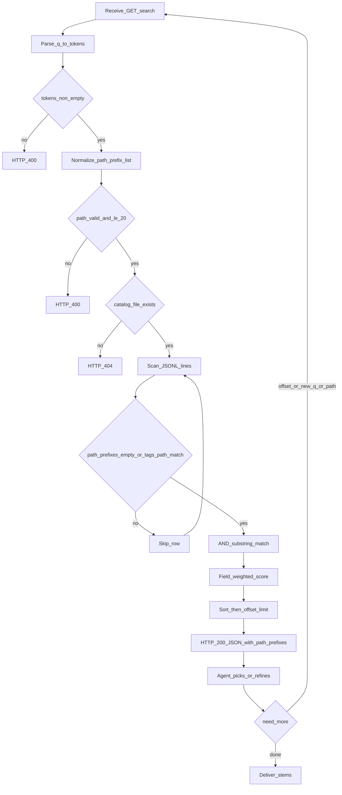
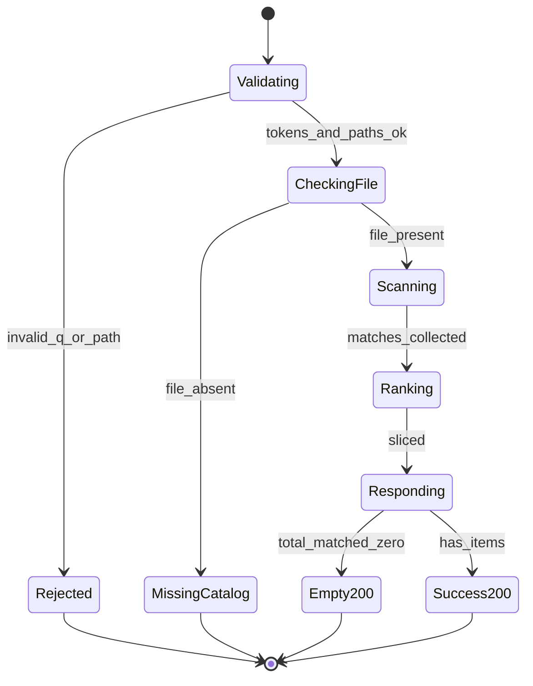

# PRD: Catalog Search 路径前缀过滤

| 项 | 内容 |
|---|---|
| 状态 | 工程：`accepted`（见文末「工程验收状态」） |
| 范围 | 扩展现有 `GET /v1/catalog/search`：可选 `path_prefix`（1～N，OR）；只过滤 `tags_path`；`q` 仍必填；响应回显 `path_prefixes`；契约 / workflow / OpenAPI JSON / 测试同步 |
| 关联文档 | `docs/contracts/material-tags-catalog.md`、`docs/workflows/serve-catalog-service.md`、`src/catalog_service/search.py`、`src/catalog_service/api.py` |
| 父/相关 | `specs/prds/prd-00002-catalog-keyword-search.md`（关键词 search 基线；本 PRD **追加**路径作用域，不改 AND/加权/分页语义） |

## 1. 背景与问题

### 1.1 现状

- `GET /v1/catalog/search?q=&limit=&offset=` 已按关键词对全库 catalog JSONL 做 AND 子串匹配与加权排序（见 prd-00002）。
- 素材盘通常按**项目 / 客户目录**组织（如「蜜梨的素材库」）；调用方或 Agent 已知道「只要某项目下的素材」时，仍会返回其他项目命中，浪费上下文、干扰精选。

### 1.2 要解决的问题

1. **路径作用域**：在 search 上增加可选路径前缀限制，只返回指定目录子树内的命中行。
2. **多路径并集**：一次请求可限定路径 A **或** 路径 B（OR），覆盖「同时看两个项目」的场景。
3. **对接友好**：机器可读 `/openapi.json`（及 `/docs`）须同步暴露新查询参数与响应字段，第三方按 schema 对接即可。

### 1.3 价值假设

「先定项目路径 → 再关键词搜」成为找素材主路径的一环后，跨项目噪音下降；本仓仍保持轻量 JSONL 扫描，不上独立搜索引擎。

## 2. 目标与非目标

### 2.1 目标（MVP / Release 0）

- 扩展 **`GET /v1/catalog/search`**：新增可选重复 query 参数 `path_prefix`（0～N）。
- 未传 `path_prefix`：行为与现网一致（全库关键词检索）。
- 传入一个或多个：仅 `tags_path` 满足**目录边界前缀**且关键词 AND 命中的行进入候选；多前缀为 **OR**。
- `q` **仍必填**；分词后无 token → 400。
- 响应增加 `path_prefixes: string[]`（规范化后生效列表；未传为 `[]`）。
- **`total_matched`** 只计路径关通过且关键词命中的行数；排序 / `limit` / `offset` 规则不变。
- **OpenAPI JSON 同步**：`path_prefix` 入参与 `path_prefixes` 响应须出现在运行时 `/openapi.json` 与 Swagger `/docs`。
- 更新契约摘要、serve workflow；pytest 覆盖前缀边界、多路径 OR、非法路径、OpenAPI 字段可见性（推荐）。

### 2.2 非目标

- 无 `q` 时的「纯路径浏览 / 列目录」。
- 按 `media_guess` 过滤；glob；排除路径（NOT）。
- 独立 `GET /v1/catalog/by-path` 接口。
- 改关键词为 OR；改加权分制；暴露 `score`。
- 向量 / FTS / SQLite；改 JSONL 行 schema。
- 手写第二份与 FastAPI 脱节的 OpenAPI 文件（以运行时 `/openapi.json` 为唯一机器契约）。
- 鉴权、内存常驻整表索引。

## 3. 术语

| 术语 | 含义 |
|---|---|
| `path_prefix` | 查询参数：相对 `CATALOG_ROOT` 的目录前缀（posix）；可重复多次 |
| `path_prefixes` | 响应字段：规范化后实际生效的前缀列表 |
| 目录边界前缀 | 行 `tags_path` **等于** prefix，或以 `prefix/` 开头（避免 `项目A` 误匹配 `项目A备份`） |
| 路径关 | 未设前缀则通过；设了则须至少一个前缀命中（OR） |
| 正式索引源 | 磁盘上的 catalog JSONL；search 只读 |

## 4. 已拍板规则 / 取舍

| 主题 | 决议 | 说明 |
|---|---|---|
| 匹配字段 | **仅 `tags_path`** | 与盘面目录结构一致；不看 `media_guess` |
| `q` | **仍必填** | 路径只是额外过滤；与 prd-00002 兼容 |
| 多路径 | **OR** | 命中任一 `path_prefix` 即通过路径关 |
| 参数形态 | 重复 query：`path_prefix=A&path_prefix=B` | FastAPI `list[str]` 自然；未传 = 全库 |
| 前缀语义 | **目录边界** | 等于或 `prefix/` 前缀 |
| 路径大小写 | **字面匹配**（不做 casefold） | 与 catalog 行 posix 字面一致；关键词字段仍 casefold |
| 规范化 | `\`→`/`；去首尾 `/`；空串丢弃 | 规范化后列表去重（保序推荐） |
| 非法路径 | 含 `..`、或规范化后仍像绝对路径（如以 `/` 开头）→ **400** | 防止逃逸语义 |
| 条数上限 | 单次请求 `path_prefix` 规范化后最多 **20**；超出 → **400** | 防滥传 |
| `total_matched` | 路径关 ∩ 关键词命中 | 分页基数与过滤后集合一致 |
| 响应回显 | 必含 `path_prefixes` | 对接方确认生效范围 |
| OpenAPI | **R0 必同步** | Query + `CatalogSearchResponse` 自动导出；描述写清多值 OR / 目录边界 |
| 数据源 | 每次读 JSONL | 无 FTS；坏行跳过；缺文件 404 |

### 示例

```http
GET /v1/catalog/search?q=图&limit=50&path_prefix=蜜梨的素材库
GET /v1/catalog/search?q=图&path_prefix=蜜梨的素材库&path_prefix=项目A
```

## 5. 用户与角色

| 角色 | 目标 |
|---|---|
| 剪辑/运营（经 Agent） | 在指定项目目录内找素材 |
| Agent / 大模型 | 带 `path_prefix` 调 search，只消化该范围候选 |
| 第三方对接方 | 从 `/openapi.json` 发现参数与响应 schema |
| 运维 | curl 验收单路径 / 多路径 / 非法路径 |
| 开发 | 纯函数可测的前缀规范化与匹配；API 薄封装 |

## 6. 功能域

| 域 | 产品要求 | 工程落点（指引） |
|---|---|---|
| 路径规范化 / 校验 | 规范化、非法 400、上限 20 | `src/catalog_service/search.py`（或同级小函数） |
| 路径匹配 | 目录边界；多前缀 OR；在关键词打分之前过滤 | `search_catalog(...)` 增加 `path_prefixes` 参数 |
| HTTP | 重复 `path_prefix` Query；响应 `path_prefixes` | `src/catalog_service/api.py`：`CatalogSearchResponse` |
| OpenAPI | `/openapi.json` 与 `/docs` 可见新字段 | FastAPI 模型/Query description，不另维护脱节文件 |
| 契约 / workflow | 参数表、匹配规则、Agent「先定项目再搜」 | `docs/contracts/`、`docs/workflows/serve-catalog-service.md`；摘要变更登记 `docs/doc_index.md` |
| 测试 | 边界前缀、多路径 OR、非法 `..`、未传兼容、openapi 含字段名 | `tests/src/catalog_service/test_search.py`、`test_api.py` |

## 7. 用户故事地图与版本切片

### 7.1 旅程主干

| 步骤 | 节点 | 说明 |
|---|---|---|
| 1 | Entry | 用户/Agent 已知项目目录（如「蜜梨的素材库」）并提出找素材需求 |
| 2 | 构造约束 | 写入一个或多个 `path_prefix`；提炼关键词写入 `q` |
| 3 | 调用 search | `GET /v1/catalog/search?q=…&path_prefix=…` |
| 4 | 读候选 | 阅读 `items`；核对 `path_prefixes` 与 `total_matched` |
| 5 | 精选 | 输出 1～N 个 `stem` 及 `tags_path` / `media_guess` |
| 6 | 分支 | 不满意：改路径、改词、或增大 `offset` |
| 7 | Exit / Teardown | 交付定位；或确认范围内无合适素材 |

**逆向**：非法路径 → 400 修正参数；0 命中 → 改前缀或改 `q`；404 catalog 缺失 → rebuild / 检查 `CATALOG_ROOT`。

### 7.2 用户故事地图

#### 阶段 A：路径作用域可达

| 故事 | 验收要点 |
|---|---|
| 作为 Agent，我想要按项目目录限制 search，以便不混入其他项目 | 传单个 `path_prefix` 时，返回行的 `tags_path` 均满足目录边界前缀 |
| 作为调用方，我想要一次限定多个路径，以便并查两个项目 | `path_prefix=A&path_prefix=B` 返回并集；仅在 A 或仅在 B 下的命中均可出现 |
| 作为调用方，我不传路径时行为应与现网一致 | 无 `path_prefix` 时全库检索；响应 `path_prefixes=[]` |
| 作为调用方，`q` 仍必须有关键词 | 缺 `q` 或无 token → 400（即使带了 `path_prefix`） |

#### 阶段 B：边界与计数正确

| 故事 | 验收要点 |
|---|---|
| 作为用户，我不希望 `项目A` 误匹配 `项目A备份` | 目录边界：仅等于或 `项目A/` 前缀 |
| 作为调用方，我想知道过滤后命中总数 | `total_matched` 仅计路径关 ∩ 关键词命中；分页基于该集合 |
| 作为调用方，我想确认服务端理解的路径 | 响应含规范化后的 `path_prefixes` |
| 作为调用方，非法路径应被拒绝 | 含 `..` 或绝对路径语义 → 400；超过 20 个前缀 → 400 |

#### 阶段 C：对接与文档

| 故事 | 验收要点 |
|---|---|
| 作为对接方，我想从 OpenAPI JSON 看到新契约 | `GET /openapi.json` 中 search 操作含参数 `path_prefix`；响应 schema 含 `path_prefixes`；`/docs` 可见 |
| 作为运维/Agent，我想有文档示例 | serve workflow 参数表与 curl 示例含单路径、多路径 |
| 作为开发，我想要单测覆盖关键路径 | 纯函数 + API 测：边界误伤、OR、非法、未传兼容 |

### 7.3 Release 切片

#### Release 0（必选 · MVP）

| 做 | 可验收结果 |
|---|---|
| `path_prefix` 可选重复参数 + 规范化/校验 | curl / OpenAPI 可调；非法 → 400；上限 20 |
| 目录边界 + 多前缀 OR + 既有关键词排序分页 | 单测：误伤前缀、并集、未传全库 |
| 响应 `path_prefixes`；`total_matched` 语义 | JSON 字段齐全 |
| **OpenAPI JSON 同步** | `/openapi.json` 与 `/docs` 含入参与响应字段；可选测试断言字段名 |
| 契约 / workflow / doc_index 摘要 | 文档可验收 |

**Release 0 不做**：无 `q` 浏览；`media_guess` 过滤；glob；独立 by-path API。

#### Release 1（可选 · 同 PRD 增强）

| 本期做 | 本期不做 |
|---|---|
| Agent「先定项目再搜」加长说明与多路径 curl 样例 | 向量 / FTS / 排除路径 / 纯路径列表 |
| OpenAPI `description` 文案再润色（若 R0 已够用可跳过） | 手写第二份 OpenAPI 文件 |

**禁止** Release 2 及更高；溢出能力进 §非目标或独立 PRD。

## 8. 核心流程与状态机图

### 8.1 检索主流程（Flowchart）



### 8.2 一次 search 请求视角（State Diagram）



**死胡同预警**：`MissingCatalog` 不能靠 search 造索引——须 `POST /v1/catalog/rebuild` 或检查配置；路径写错导致 `Empty200` 时应引导核对 `path_prefixes` 与盘面相对路径，而非当成服务故障。

## 9. 数据与 API 衔接

### 9.1 请求

| 参数 | 类型 | 默认 | 说明 |
|---|---|---|---|
| `q` | string | （必填） | 关键词；空白 / `,` / `，` 分词；多词 AND |
| `limit` | int | 20 | 1～100；超出钳制到 100 |
| `offset` | int | 0 | ≥0 |
| `path_prefix` | string[]（重复 query） | 未传 | 相对 root 的目录前缀；0～20；多值 OR；目录边界匹配 `tags_path` |

### 9.2 响应（200）

在既有字段上增加：

| 字段 | 类型 | 说明 |
|---|---|---|
| `query` | string | 原始 `q` |
| `tokens` | string[] | 分词结果 |
| `limit` / `offset` | int | 生效值 |
| `total_matched` | int | 路径关 ∩ 关键词命中总数 |
| `path_prefixes` | string[] | 规范化后生效前缀；未传为 `[]` |
| `items` | object[] | catalog 行；与契约一致；**不含** score |

### 9.3 OpenAPI 机器契约

- 权威来源：服务运行时 **`GET /openapi.json`**（Swagger UI：`/docs`）。
- R0 验收：search 的 parameters 含 `path_prefix`；response schema（`CatalogSearchResponse`）含 `path_prefixes`。
- 实现方式：扩展 FastAPI `Query` 与 Pydantic 响应模型，**禁止**维护与代码脱节的第二份 OpenAPI 手稿。

### 9.4 匹配伪规则（产品级）

```
normalize(p) -> 正斜杠、去首尾 /、拒绝 .. 与绝对路径
row_ok_path:
  if path_prefixes empty: true
  else: any(prefix: tags_path == prefix or tags_path.startswith(prefix + "/"))
row_ok: row_ok_path and AND_keyword_match
```

## 10. 成功标准（可度量）

1. 单路径过滤：固定 fixture 下，带 `path_prefix` 的结果集 ⊆ 该前缀子树，且不含故意放置的兄弟前缀撞名目录。
2. 双路径 OR：A 独有与 B 独有命中同时可出现在结果中（在 `limit` 允许时）。
3. 回归：不传 `path_prefix` 时，与改造前同 fixture 的排序/分页结果一致（或文档声明的等价行为）。
4. OpenAPI：对运行中 app 取 `/openapi.json`，可解析到上述字段名。
5. 非法路径与超限：稳定 400，不 500。

## 11. 依赖与风险

| 项 | 说明 | 缓解 |
|---|---|---|
| 依赖 prd-00002 | 关键词管道已存在 | 路径关插在打分前，少改排序 |
| 调用方不知道相对路径字面 | 易 Empty200 | 文档强调相对 `CATALOG_ROOT`；响应回显 `path_prefixes` |
| 大库全表扫描 | 与现网一致 | 千～万级可接受；性能不足另开 PRD |

## 12. 假设与待确认 / 开放项

| 项 | 状态 |
|---|---|
| 路径字面匹配（不 casefold） | **已定** |
| 单次最多 20 个 `path_prefix` | **已定** |
| 规范化后去重是否保序 | 建议保序去重；工程实现写清即可 |
| 空字符串 `path_prefix=` 是否 400 或忽略 | 建议忽略空串；若全部被忽略且未传有效前缀 → 视为未设路径（全库） |
| Windows 盘符大小写混用 | 开放：若现场撞车再议；默认字面 |

## 13. 修订记录

| 日期 | 说明 |
|---|---|
| 2026-07-30 | 初稿：路径前缀过滤、多路径 OR、`q` 必填、仅 `tags_path`、OpenAPI JSON R0 同步 |

## 14. 工程验收状态

> 由 `/team:prd-accept` 维护；勿手工编造「通过」。最后更新：2026-07-30T08:22:15Z，main@fe1fe94（**本 PRD 实现仍在工作区未提交**），范围：R0,R1。

### 总览

| 项 | 内容 |
|---|---|
| 工程状态 | `accepted` |
| 验收判定 | 通过 |
| 最近验收 | 2026-07-30T08:22:15Z |
| 代码基线 | `main@fe1fe94` + 工作区未提交变更（`search.py` / `api.py`、契约 / serve workflow / doc_index、pytest） |
| 摘要 | ① 可选重复 `path_prefix` + 规范化/校验（`..` / 绝对路径 / ≤20）；② 目录边界 + 多前缀 OR，打分前路径关；③ 响应 `path_prefixes`，`total_matched` 为过滤后集合；④ OpenAPI /docs 同步；⑤ R1 Agent「先定项目再搜」与多路径 curl；⑥ 本地 pytest + 真实盘 E2E curl 通过 |

### Release 交付

| Release | 状态 | 说明 |
|---|---|---|
| R0 | 通过 | `normalize_path_prefixes` / 路径关 / HTTP Query + 响应 + OpenAPI + 契约/workflow/doc_index + pytest |
| R1 | 通过 | serve workflow Agent 两段式加长说明；单路径/多路径 curl 样例；端点 description 含「先定路径再搜」 |

### 功能验收清单（Agent 优先读此表）

| ID | 能力摘要 | Release | 状态 | 证据 |
|---|---|---|---|---|
| R0-01 | 可选重复 `path_prefix`；未传全库；响应 `path_prefixes=[]` | R0 | 通过 | `api.py` Query；`test_search_ok`；E2E：`q=访谈` → `path_prefixes=[]`，`total_matched=4` |
| R0-02 | 单前缀目录边界过滤 `tags_path` | R0 | 通过 | `tags_path_matches_any_prefix`；`test_search_catalog_path_prefix_filter`；E2E：`…/第一天-逛园区/已打标` → 仅 C0306 |
| R0-03 | 多前缀 OR | R0 | 通过 | `test_search_path_prefix`（API）；E2E：`项目A-郑店采访` + `项目B-归档` |
| R0-04 | `q` 仍必填（即使带 path_prefix） | R0 | 通过 | `test_search_path_prefix_still_requires_q`；E2E 空/空白 q → 400 |
| R0-05 | 非法 `..` / 绝对路径 / 超限 20 → 400 | R0 | 通过 | `normalize_path_prefixes` + `PathPrefixError`；`test_normalize_*` / `test_search_path_prefix_invalid_400`；E2E |
| R0-06 | 目录边界防误伤（`项目A` vs `项目A备份`） | R0 | 通过 | `test_tags_path_matches_directory_boundary`；fixture 含 `项目A备份`；E2E：不完整段 `…/第二天` 不命中 `…/第二天-访谈` |
| R0-07 | `total_matched` = 路径关 ∩ 关键词；排序分页不变 | R0 | 通过 | `search_catalog` 路径关在 `score_record` 前；既有 sort/paging 测仍过 |
| R0-08 | OpenAPI：`path_prefix` 入参 + `path_prefixes` 响应 | R0 | 通过 | `test_openapi_includes_search`；运行时 `/openapi.json` 含字段名 |
| R0-09 | 契约 / serve workflow / doc_index | R0 | 通过 | `docs/contracts/material-tags-catalog.md`；`docs/workflows/serve-catalog-service.md`；`docs/doc_index.md` |
| R1-01 | Agent「先定项目再搜」说明 + 多路径 curl | R1 | 通过 | `serve-catalog-service.md` Agent 步骤与验收 curl；`api.py` endpoint description |
| NX-01 | 无 q 纯路径浏览 / media_guess 过滤 / glob / by-path API | — | 范围外 | §2.2 非目标 |
| NX-02 | 向量 / FTS / 排除路径 / 第二份手写 OpenAPI | — | 范围外 | §2.2 / R1 本期不做 |

### 未完成与遗留

- 本 PRD 实现与本文件均尚未 `git commit`；合并前建议提交后把 `accepted_commit` 改为含实现的 commit。
- Windows 盘符大小写混用仍为 §12 开放项（默认字面匹配），现场撞车再议。

### 质量检查

| 检查项 | 状态 |
|---|---|
| `.venv/bin/python -m pytest -q`（search + api） | 通过（25 passed） |
| （无） | — |
| 文档与 OpenAPI 同步 | 通过（契约 / workflow / doc_index；`/openapi.json` 实测含 `path_prefix` / `path_prefixes`） |

---
统计：通过 10 / 部分 0 / 未实现 0 / 范围外 2
