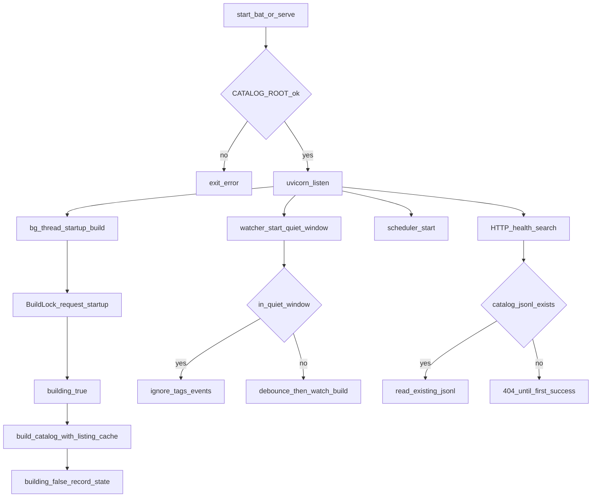
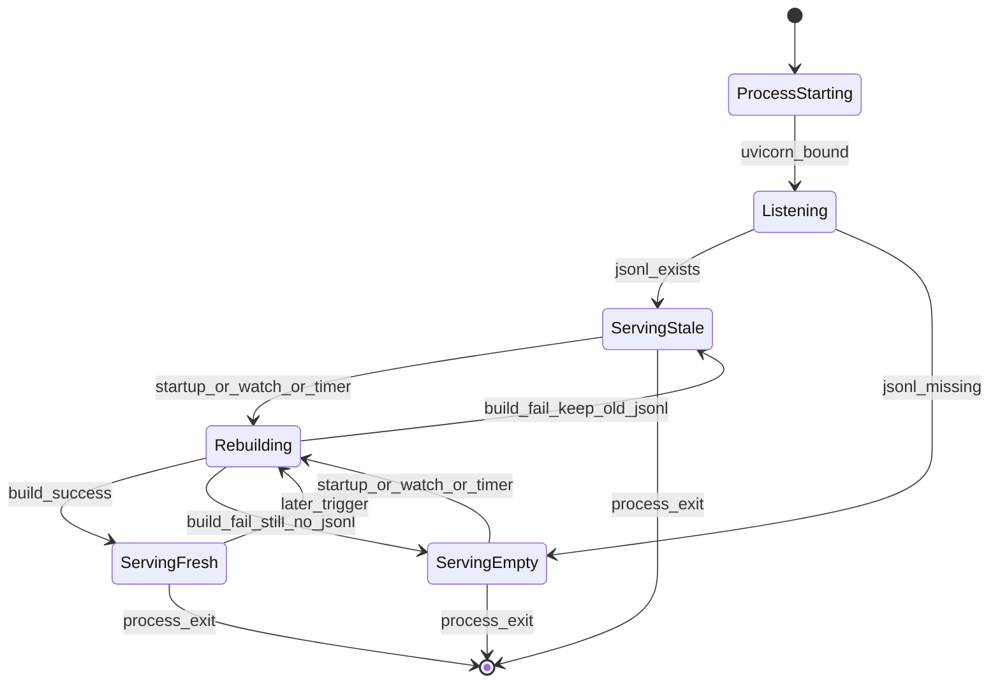

# PRD: 非阻塞启动重建（先服务、后台建索引）

| 项 | 内容 |
|---|---|
| 状态 | 工程：`accepted`（见文末「工程验收状态」） |
| 范围 | 常驻 `serve`：启动不再同步等待全量 build；watch 启动静默；单次 build 内目录列表缓存；文档 / `.env.example` / 测试同步 |
| 关联文档 | `docs/workflows/serve-catalog-service.md`、`docs/faqs/watch-unreliable-on-network-drive.md`、`.env.example`、`src/catalog_service/service.py`、`src/catalog_service/watcher.py`、`src/catalog_service/builder.py`、`src/catalog_service/media_guess.py`、`src/catalog_service/build_lock.py` |
| 父/相关 | 不改 search 契约（`prd-00002` / `prd-00006`）；不改 orphan/排除写侧语义（`prd-00003`～`00005`） |

## 1. 背景与问题

### 1.1 现状

- 常驻入口 `run_serve` 在 `uvicorn.run` **之前**同步执行 `build_lock.request("startup", run_build)`。
- 素材盘常在 SMB / 映射盘（如 `E:\huanyuan-share\…`）。全量扫描约千级 `*.material-tags.json` 时，单次 startup build 可达 **数十秒～数分钟**（现场样例：`written=1085`，`duration_ms≈94265`）。
- 该窗口内 **端口未监听**：运维与 Agent 无法 `/health`、无法 search；用户感知为「启动卡住」。
- watcher 启动后约 debounce 秒数内常再触发 `trigger=watch` 全量；startup 已结束后的 watch **不会**被 `BuildLock` pending 合并，形成 **连续两轮** 昂贵全量。
- `guess_media_path` 对同目录每条标签重复 `iterdir()`，在 `.material_index` 密集旁车场景放大网络盘 I/O。

### 1.2 要解决的问题

1. **启动可服务**：进程起来后尽快对外 HTTP；startup 重建不挡 listen。
2. **避免启动后误触发二次全量**：watcher 刚挂载时的噪声 / 延迟事件不立刻再跑一轮。
3. **缩短单次全量墙钟时间**（同盘同规模下）：单次 build 内复用目录 listing，不改猜媒体语义。

### 1.3 价值假设

运维与 Agent 依赖「服务已起来」才能探活与检索；已有 `material-tags-catalog.jsonl` 时，用略旧索引先服务优于长时间完全不可用。网络盘上 watch 本就不可靠（见 FAQ），定时兜底仍是正确性主路径；启动体验应与此一致——**可用性优先于启动瞬间索引绝对新鲜**。

## 2. 目标与非目标

### 2.1 目标（MVP / Release 0）

- 删除 listen 前的同步 startup build；在 FastAPI `lifespan` 内用 **daemon 后台线程** 调用 `build_lock.request("startup", run_build)`。
- 已有 JSONL → listen 后立即可 search / 流式读；缺失 → 与现契约一致（search/catalog **404**），`/health` 的 `building` 可反映重建中。
- startup 失败：打错误日志，**不**拖垮进程（与今日「startup 失败仍 continue」一致）。
- 新增 `WATCH_STARTUP_QUIET_SEC`（默认 **10**）：watcher 启动后静默期内忽略 tags 事件，不 debounce、不触发 rebuild。
- 单次 `build_catalog` 内对目录 listing **缓存**；`guess_media_path` 无缓存调用行为不变。
- 同步 `docs/workflows/serve-catalog-service.md`、`.env.example`；必要摘要进 `docs/doc_index.md`；pytest 覆盖静默窗与「主路径不 join startup」。

### 2.2 非目标

- 增量 / 差量索引；按 mtime 跳过未变文件的「智能全量」。
- 多进程 / 线程池并行扫盘。
- 改 search 排序、契约字段、HTTP 路径集合。
- 改 `BuildLock` 的「busy + pending 一轮」语义（本 PRD 只避免 startup 结束后再无意义 watch 全量）。
- 便携包打包脚本大改；发版流程变更（可由后续 cut-release 单独做）。
- 管理 UI；强制「无 JSONL 则拒绝 listen」。

## 3. 术语

| 术语 | 含义 |
|---|---|
| startup build | 常驻启动时自动触发的一轮全量 `build_catalog`，`trigger=startup` |
| 非阻塞启动 | listen / 接受 HTTP 不依赖 startup build 完成 |
| watch 启动静默窗 | watcher `start` 后一段时间内忽略相关 FS 事件 |
| 目录 listing 缓存 | 单次 build 内，同一目录的 `iterdir` 结果复用 |
| 略旧索引 | 磁盘上已有 JSONL，尚未被本轮 startup 刷新 |

## 4. 已拍板规则 / 取舍

| 主题 | 决议 | 说明 |
|---|---|---|
| 启动与 listen | **先 listen，后台 startup** | 解决「卡住不可用」主痛点 |
| 无 JSONL | **仍 listen**；读接口 404 | 与现契约一致；靠 health/`building` 与定时/手动 rebuild |
| 有 JSONL | **立即可读**略旧索引 | 正确性靠随后 startup + 定时兜底 |
| 静默窗默认 | **`WATCH_STARTUP_QUIET_SEC=10`** | 覆盖现场 debounce≈2s 后的误触发；可 env 调 |
| 静默期行为 | **不 schedule debounce** | 静默过后事件恢复正常 |
| 目录缓存范围 | **仅单次 `build_catalog` 调用内** | 不跨 build 共享，避免陈旧 listing |
| 猜媒体语义 | **不变** | 同目录优先；`.material_index` 可上翻父目录；白名单不变 |
| 增量索引 | **不做** | 进非目标 |
| 定时 / HTTP rebuild | **行为不变** | 仍走 `BuildLock` + 同一 `build_catalog` |

### 默认假设（用户以「把上面的方案落成 PRD」确认）

- 采用工程方案三件套：后台 startup + 静默窗 + listing 缓存。
- 不要求「无索引时阻塞到第一轮完成」。
- 静默窗默认 10s，不引入更复杂的「等 startup 完成再开 watch」耦合（静默窗更简单、可配置）。

## 5. 用户与角色

| 角色 | 目标 |
|---|---|
| 现场运维（Windows 便携包 / `start.bat`） | 启动后尽快确认服务活着、可局域网探活 |
| Agent / 检索调用方 | 启动后尽快 `GET /v1/catalog/search`，不长时间连不上 |
| 本仓开发 | 行为可测、与 serve workflow / env 文档一致 |
| 素材盘维护者 | 启动后索引仍会刷新；不因优化丢定时兜底 |

## 6. 功能域

| 域 | 说明 |
|---|---|
| F1 非阻塞 startup | `service.run_serve` / lifespan：后台线程 + 不 join |
| F2 watch 静默 | `CatalogWatcher` / handler + `Settings.WATCH_STARTUP_QUIET_SEC` |
| F3 listing 缓存 | `builder` ↔ `media_guess` 可选 cache |
| F4 可观测 | 日志顺序：先 serving / Uvicorn，后 `build start trigger=startup`；health `building` |
| F5 文档与配置 | serve workflow、`.env.example`、doc_index 摘要 |

## 7. 用户故事地图与版本切片

### 7.1 旅程主干

| 步骤 | 节点 | 说明 |
|---|---|---|
| Entry | 运维执行 `start.bat` / `serve.py` | `CATALOG_ROOT` 已配置 |
| 1 | 进程校验 root | 非法则仍快速失败退出 |
| 2 | HTTP listen | 秒级内可访问（相对今日数分钟） |
| 3 | 后台 startup build | `building=true` 期间可读旧 JSONL 或 404 |
| 4 | watcher 静默窗 | 启动噪声不触发 rebuild |
| 5 | startup 完成 | 日志 `build done trigger=startup`；`building=false` |
| 6 | 正常 watch / 定时 | 静默结束后真实变更可 debounce rebuild |
| Exit | 停服 / CTRL+C | watcher/scheduler 停止；daemon 线程随进程结束 |

### 7.2 用户故事地图

**阶段 A — 启动可用性**

| 故事 | 验收要点 |
|---|---|
| 作为运维，我想要启动后立刻能打开 `/health`，以便确认进程已对外 | listen 不依赖 startup 完成；日志中 `serving` / Uvicorn 出现在 startup `build done` **之前**（或至少不要求先 `build done`） |
| 作为 Agent，我想要在已有 JSONL 时启动后马上 search，以便不等 90s+ | 已有 catalog 文件时，listen 后短时间内 search 可 200（内容可为略旧） |
| 作为运维，我想要无 JSONL 时服务仍起来，以便先探活再等重建 | 无文件时 search/catalog 404；进程不退出；startup 后台仍跑 |

**阶段 B — 避免双全量**

| 故事 | 验收要点 |
|---|---|
| 作为运维，我不希望刚启动完就无故再跑一轮 watch 全量，以便省时间与盘负载 | 默认静默窗内 tags 事件不触发 `watch debounce fired`→rebuild；过静默后可触发 |
| 作为开发，我想要用 env 调节静默秒数，以便不同盘延迟可调 | `WATCH_STARTUP_QUIET_SEC` 可读；写入 `.env.example` |

**阶段 C — 单次 build 加速**

| 故事 | 验收要点 |
|---|---|
| 作为运维，我想要同规模盘上单次全量更快（或至少不更慢），以便后台重建尽早结束 | 同目录多标签时 listing 不按条重复 `iterdir`；猜媒体命中结果与改前一致（pytest） |

### 7.3 Release 切片

#### Release 0（MVP）

- 后台 startup；不阻塞 listen。
- `WATCH_STARTUP_QUIET_SEC` 默认 10 + watcher 静默行为。
- 单次 build 目录 listing 缓存。
- 文档 / `.env.example` / pytest。

**可验收结果**：便携包或开发 serve 启动后，在 startup 完成前即可 `/health`；有 JSONL 时可 search；短时内无「startup 刚结束又立刻 watch 全量」的默认浪费；单元测试绿。

#### Release 1（可选增强，仍属本 PRD）

- `/health` 或 meta 显式区分 `startup_pending` / 上次 startup 结果摘要（若 R0 的 `building` + 日志已够用则可不做）。
- 静默窗与 debounce 关系的文档 FAQ 短文（网络盘延迟事件）。

**本期不做（禁止 R2）**：增量索引、并行扫盘、无 JSONL 阻塞 listen——见 §非目标 / §开放项。

## 8. 核心流程与状态机图

### 8.1 启动与重建主流程

### 8.2 服务就绪与索引新鲜度状态

> 断头路扫描：无「重建失败则退出进程」死胡同；失败保留旧 JSONL 或继续 Empty+404。静默窗结束前真实改盘：依赖静默后事件或定时兜底（与网络盘 FAQ 一致），不在本 PRD 发明第三套同步机制。

## 9. 数据与 API 衔接

| 面 | 变更 |
|---|---|
| JSONL 行契约 | **不变** |
| `GET /health` | 继续暴露 `building`；语义覆盖后台 startup |
| `GET /v1/catalog/search` 等读接口 | **不变**；无文件仍 404 |
| `POST /v1/catalog/rebuild` | **不变** |
| 环境变量 | 新增 `WATCH_STARTUP_QUIET_SEC`（默认 10） |
| CLI `build.py` 一次性 | **不变**（仍同步全量） |

## 10. 场景与边界（产品校验）

### 10.1 端到端场景（≥5）

1. 有 JSONL + 网络盘：启动后数秒内 health/search 可用，后台再刷新。
2. 无 JSONL：listen 成功，search 404，startup 完成后变为 200。
3. 启动瞬间盘上有 tags 噪声事件：静默窗内不二次全量。
4. 静默结束后用户改旁车：debounce 后正常 watch rebuild。
5. startup 进行中 Agent 调 `POST /rebuild`：Busy → 202 queued / pending 合并（既有 BuildLock）。
6. startup 失败（权限等）：日志 exception，进程继续，旧 JSONL 仍可读。

### 10.2 边界与异常（≥5）

1. `CATALOG_ROOT` 不存在：仍启动前快速失败（不 listen）。
2. 静默窗 = 0：等效关闭静默（可测）。
3. 静默窗很长：真实变更延迟到静默结束或等定时——可接受，文档说明。
4. listing 缓存与 purge orphan：同一次 build 内删文件后，缓存不跨 build；单次 build 内对已 listing 目录的删除与后续同目录条目——保持与现「按路径处理顺序」一致，不另造一致性协议。
5. Windows 控制台快速编辑：与本 PRD 无关，既有 FAQ 仍适用。

## 11. 假设与开放项

| 项 | 状态 |
|---|---|
| 三件套方案（后台 startup + 静默 + listing 缓存） | **已定**（方案落 PRD） |
| 无 JSONL 不阻塞 listen | **已定** |
| 静默默认 10s | **已定**；现场可调 |
| R1 是否增强 health 字段 | **开放**；R0 用现有 `building` 即可 |
| 是否单独 FAQ「启动静默与网络盘延迟事件」 | **开放**（可进 R1） |
| 发版号 / upgrades 文案 | **开放**；实现合并后由 cut-release 流程处理 |

## 12. 头脑风暴纪要（收敛）

**必做**：非阻塞 startup；静默窗；文档与测试。  
**应做**：listing 缓存（同改动成本低、网络盘收益高）。  
**可做→非目标**：health 扩展字段；专用 FAQ。  
**不做**：增量索引、并行扫盘、无索引拒听。

**关键决策（已拍板）**：先服务后重建；静默用固定秒数而非强耦合「等 startup 完再开 watch」；缓存仅单次 build。

## 13. 修订记录

| 日期 | 说明 |
|---|---|
| 2026-08-11 | 初稿：由现场启动阻塞日志与工程方案「Startup build optimize」落成 PRD |

## 14. 工程验收状态

> 由 `/team:prd-accept` 维护；勿手工编造「通过」。最后更新：2026-08-11T06:22:38Z，main@8fa4952（**本 PRD 实现仍在工作区未提交**），范围：R0,R1。

### 总览

| 项 | 内容 |
|---|---|
| 工程状态 | `accepted` |
| 验收判定 | R0 三件套（后台 startup + 静默窗 + listing 缓存）+ 文档/测试齐备；R1 为可选增强且 PRD 声明「R0 的 building + 日志已够用则可不做」，本轮标范围外 |
| 最近验收 | 2026-08-11T06:22:38Z；pytest 72 passed；本地 `dev-serve` 日志与 HTTP 探活（`/health`、search） |
| 代码提交 | 工作区相对 `8fa4952` 未 commit（含 `service`/`watcher`/`media_guess`/`builder`/`config`、测试与 docs） |

摘要：

1. `run_serve` lifespan daemon 线程跑 `trigger=startup`，主路径不 join；日志 `serving` → `Uvicorn running` → `build done`。
2. `WATCH_STARTUP_QUIET_SEC` 默认 10；静默期内不 schedule；`.env.example` / serve workflow / doc_index 已同步。
3. 单次 `build_catalog` 内 `dir_listing_cache`；无 cache 的 `guess_media_path` 语义不变（pytest）。
4. 真实 serve：有 JSONL 时 health/search 200；watcher 日志 `quiet_sec=10.0`，启动后未见立刻 `watch debounce fired`。
5. R1（`startup_pending` health 字段、专用 FAQ）未做，按开放项/可选增强记范围外。

### Release 交付

| Release | 状态 | 说明 |
|---|---|---|
| R0 | 通过 | 非阻塞 startup、静默窗、listing 缓存、文档与 pytest |
| R1 | 范围外 | 可选；本期以 R0 `building` + 日志为准，不做 health 扩展字段与专用 FAQ |

### 功能验收清单（Agent 优先读此表）

| ID | 能力摘要 | Release | 状态 | 证据 |
|---|---|---|---|---|
| R0-01 | lifespan daemon 后台 startup，不阻塞 listen / 不 join | R0 | 通过 | `src/catalog_service/service.py`（`startup-build` 线程）；`tests/.../test_service.py` |
| R0-02 | startup 失败只打日志不拖垮进程 | R0 | 通过 | `service.py` `startup build failed; continuing` |
| R0-03 | `WATCH_STARTUP_QUIET_SEC` 默认 10；静默期内不 schedule | R0 | 通过 | `config.py`；`watcher.py` `_in_quiet_window`；`test_watcher.py` 静默三测 |
| R0-04 | 静默 `0` 等效关闭 | R0 | 通过 | `test_watch_quiet_window_zero_disables` |
| R0-05 | 单次 build 目录 listing 缓存；无 cache 行为不变 | R0 | 通过 | `media_guess.py` / `builder.py`；`test_dir_listing_cache_*` |
| R0-06 | serve workflow / `.env.example` / doc_index 同步 | R0 | 通过 | `docs/workflows/serve-catalog-service.md`；`.env.example`；`docs/doc_index.md` |
| R0-07 | 有 JSONL 时可 health + search；日志先 serving 后 build done | R0 | 通过 | 本地 serve 日志；`GET /health` 200；search `女企业家` 200 |
| R0-08 | `/health` 继续暴露 `building`（覆盖后台 startup） | R0 | 通过 | 既有 API；startup 期间由 `BuildLock.building` 驱动 |
| R1-01 | health/meta `startup_pending` / startup 结果摘要 | R1 | 范围外 | PRD §开放项：R0 `building` 即可 |
| R1-02 | 启动静默与网络盘延迟事件 FAQ | R1 | 范围外 | PRD §开放项；可进后续 |

### 未完成与遗留

- 本 PRD 实现与本文件均尚未 `git commit`；合并前建议提交后把 `accepted_commit` 改为含实现的 commit。
- E2E 未覆盖「无 JSONL → search 404」与静默窗内人为注入 tags 事件正对照（小盘 fixture / 只读验收限制）；单测已覆盖静默与不 join。
- 发版号 / `upgrades/`：开放项，留给 cut-release。
- R1 仍可选；若现场需要显式 `startup_pending` 再开。

### 质量检查

| 检查项 | 状态 |
|---|---|
| `.venv/bin/python -m pytest -q` | 通过（72 passed） |
| （无） | — |
| 文档与 OpenAPI 同步 | 通过（HTTP 路径未变；serve workflow / env 已更；无需改 OpenAPI 契约字段） |

---
统计：通过 8 / 部分 0 / 未实现 0 / 范围外 2
