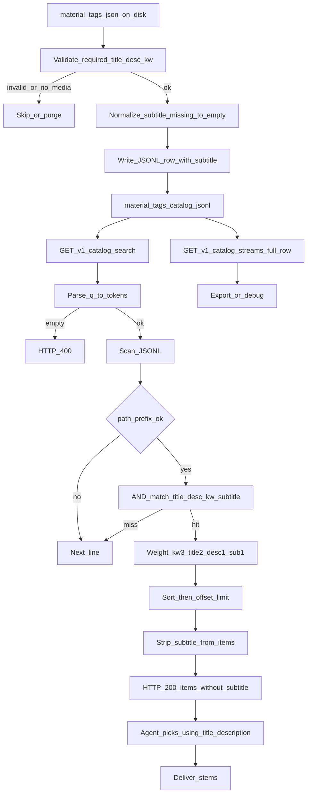
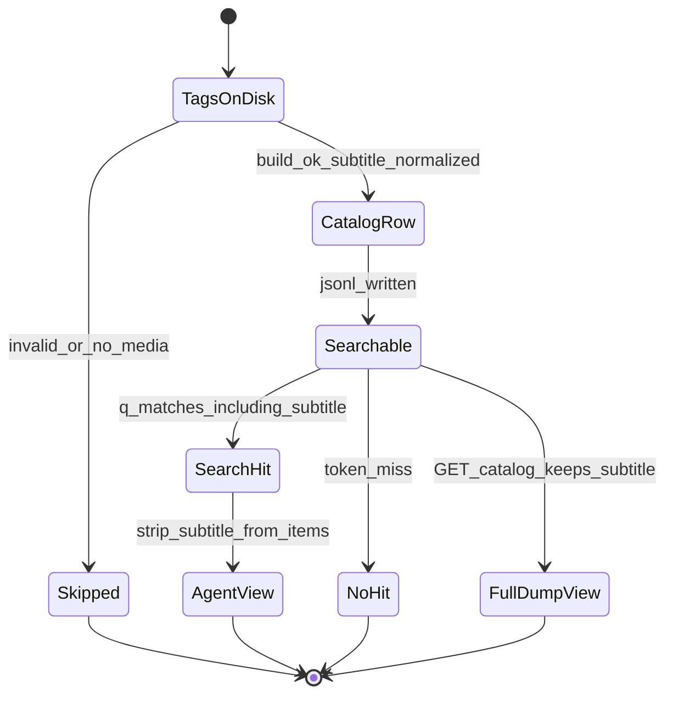

# PRD: Catalog 口播字幕索引

| 项 | 内容 |
|---|---|
| 状态 | 工程：`accepted`（见文末「工程验收状态」） |
| 范围 | 本仓 catalog JSONL 增加 `subtitle`；build 透传；`GET /v1/catalog/search` 将口播全文纳入 AND 子串匹配；search 的 `items[]` **不回**该字段；契约 / workflow / playbook / OpenAPI / pytest 同步 |
| 关联文档 | `docs/contracts/material-tags-catalog.md`、`docs/workflows/serve-catalog-service.md`、`docs/workflows/llm-media-search-playbook.md`、`src/catalog_service/models.py`、`src/catalog_service/builder.py`、`src/catalog_service/search.py`、`src/catalog_service/api.py` |
| 上游协议 | `../Codex/多媒体资源打标/docs/specs/material-tags-schema.md`（schema v4：`subtitle` = STT 口播全文；缺键当 `""`） |
| 父/相关 | `specs/prds/prd-00002-catalog-keyword-search.md`（关键词 search 基线；本 PRD **追加**可检索字段 `subtitle`，并规定 search items 对该字段的例外：不回全文） |

## 1. 背景与问题

### 1.1 现状

- 本仓将素材盘上 `*.material-tags.json` 合并为 `material-tags-catalog.jsonl`，经 `GET /v1/catalog/search` 按 `title` / `description` / `keywords` 做 AND 子串匹配与加权排序（见 `specs/prds/prd-00002-catalog-keyword-search.md`）。
- 上游打标仓 schema 已升至 **v4**：新增 `subtitle`，存放 STT 口播**全文**（来自过程稿 `transcript.json` 的 `text`）。`description` 只写口播**要点**（1–3 句「说了什么」），**不是**全文。
- 静图或未挂字幕时 `subtitle` 为 `""`（不是 `null`）。过程稿 `evidence.json` / `transcript.json` 与独立 `.srt` / `.vtt` **不上服务器**，不是本仓输入。

### 1.2 要解决的问题

1. **索引里有字段**：rebuild 后 JSONL 行必须带出 `subtitle`（旧标签缺键写 `""`），`GET /v1/catalog` 全量流可见。
2. **能靠口播原话找到片**：`q` 命中须同时覆盖 `title` / `description` / `keywords` / `subtitle`。此前只能靠 description 要点碰运气，访谈/口播出镜视频会被漏检。
3. **展示层不炸 token**：search 的 `items[]` 面向 Agent 精选，访谈全文动辄数千字；**不回** `subtitle`，避免撑爆上下文。正式索引源（JSONL / 全量 GET）仍存全文。

### 1.3 价值假设

找素材主路径变为「可以用说过的原话当 `q`」后，口播类视频/音频可被检出；本仓边界仍是贴着素材盘的索引服务，不打标、不跑 STT、不扫独立字幕文件。

## 2. 目标与非目标

### 2.1 目标（MVP / Release 0）

- **入库**：`load_material_tags` / `CatalogRecord` / `build_catalog` 透传 `subtitle`（string；缺键 / `null` / 非字符串可规范化者 → `""`），**不**因缺该键 skip 或拒收。
- **JSONL 行契约**：输出行增加 `subtitle`；原子替换写入策略不变。
- **检索**：`GET /v1/catalog/search` 的 AND 子串 haystack 增加 `subtitle`；仅口播原话出现、三字段皆未出现的 token 仍须命中该行。
- **加权**：在现有 keywords +3 / title +2 / description +1 上增加 **subtitle +1**；同一 token 每字段最多计一次；排序规则不变（分降序，同分 `stem` 升序）。
- **search 响应例外**：`items[]` 与 OpenAPI `CatalogItem` **省略** `subtitle`（不计分后剥离；不暴露空字符串占位）。`score` 仍不返回。
- **全量接口**：`GET /v1/catalog` 继续原样流 JSONL，rebuild 后行内含 `subtitle`。
- 契约、serve workflow、LLM playbook、`docs/doc_index.md` 摘要、pytest 可验收。

### 2.2 非目标

- 扫描独立 `.srt` / `.vtt` / `transcript.json` / `evidence.json`。
- 摄入 `media_type`（上游 v3 已有、本仓仍未透传；另开 PRD）。
- search items 回传全文、截断摘要（如前 200 字）、或 `matched_fields` / `subtitle_hit` 回显。
- 向量检索 / RAG / embedding；SQLite FTS5 或其他旁路全文引擎。
- 改打标仓 schema 或回填已 publish 的旧 `*.material-tags.json`（只有上游重新 `write_tags` 才写成 v4）。
- 为字幕单独增加 HTTP 接口；改 AND 为 OR；暴露 `score`。
- 同义词、拼音、错别字纠错；管理 UI。
- 本 PRD 不改 `path_prefix` / 分页 / 鉴权语义。

## 3. 术语

| 术语 | 含义 |
|---|---|
| `subtitle` | 标签 JSON / catalog 行中的口播全文（STT `text`）；图片或未挂字幕为 `""` |
| 口播要点 | `description` 里 1–3 句「说了什么」；不是全文 |
| 正式索引源 | 磁盘上的 `material-tags-catalog.jsonl`（或 `CATALOG_OUT`） |
| 可检索字段 | `title`、`description`、`keywords`、`subtitle` |
| search items 例外 | `GET /v1/catalog/search` 的 `items[]` **不含** `subtitle`；与 JSONL 行契约在该键上不一致 |
| 查询词 token | `q` 按空白与中英文逗号拆出的非空片段 |
| AND | 每个 token 都必须在可检索字段中至少一处子串命中 |

## 4. 已拍板规则 / 取舍

| 主题 | 决议 | 说明 |
|---|---|---|
| 输入范围 | **只认** `*.material-tags.json` 的 `subtitle` 键 | 不扫独立字幕文件；过程稿不上服务器 |
| 缺键兼容 | 当 `""` | 与上游 v4 读侧一致；不拒收、不 skip |
| 空值 | `""` 不是 `null` | 静图/无口播合法；空串不参与有效命中（子串匹配自然落空） |
| 必填校验 | **不**把 `subtitle` 列为入库必填 | 必填仍为 `title` / `description` / `keywords` |
| 可检索字段 | 四字段 AND 子串 + casefold | 扩展 prd-00002，不改分词 / 分页 / `path_prefix` |
| 加权 | keywords +3 / title +2 / description +1 / **subtitle +1** | 口播全文很长，避免口语虚词压过关键词 |
| JSONL / 全量 GET | **带全文** | 导出、备份、调试可见 |
| search `items[]` | **省略 `subtitle` 键** | 不回 `""` 占位；OpenAPI `CatalogItem` 不暴露该字段 |
| 历史 JSONL | 无该键时 search 当 `""` | 须 **rebuild** 后新行才带键；文档写清 |
| 数据源 | 每次请求扫 JSONL | 无 FTS、无常驻倒排；超长字幕撑大文件本期接受 |
| 坏行 | 跳过无法解析的行 | 与现网一致 |

### 与 prd-00002 的契约例外

prd-00002 写过「`items[]` 字段与 catalog 行契约一致」。本 PRD **覆盖该句仅针对 `subtitle`**：search 响应刻意比 JSONL 行少这一键；其余字段（含 v2 媒体元数据）仍与行契约一致，且仍不含 `score`。

## 5. 用户与角色

| 角色 | 目标 |
|---|---|
| 剪辑/运营（经 Agent） | 用「视频里说过的话」找到对应素材 |
| Agent / 大模型 | 把口播原话压进 `q`；只消化不含逐字稿的 top K；用 title/description 回复用户 |
| 运维 | rebuild 后验收 JSONL 有键；curl search 用仅存在于字幕的词能命中 |
| 开发 | 入库透传、计分扩展、search 剥离字段；单测覆盖缺键 / 仅字幕命中 / items 无键 |

## 6. 功能域

| 域 | 产品要求 | 工程落点（指引） |
|---|---|---|
| 标签校验 / 行模型 | 可选 string；缺省 `""`；写入 `CatalogRecord` | `src/catalog_service/models.py` |
| 合并写入 | JSONL 行含 `subtitle` | `src/catalog_service/builder.py` |
| 检索核心 | 四字段 AND + subtitle 权重 +1；返回行删除该键 | `src/catalog_service/search.py`：`score_record` / `_row_from_obj` |
| HTTP | search `CatalogItem` 不加 subtitle；全量仍流原始行 | `src/catalog_service/api.py` |
| 契约 / workflow / playbook | 行字段表、可检索字段、items 例外、口播搜法 | `docs/contracts/material-tags-catalog.md`、`docs/workflows/serve-catalog-service.md`、`docs/workflows/llm-media-search-playbook.md`；摘要变更登记 `docs/doc_index.md` |
| 测试 | 入库缺键→`""`；仅 subtitle 命中；search JSON 无该键；全量行有该键 | `tests/src/catalog_service/test_builder.py`、`test_search.py`、`test_api.py` |

## 7. 用户故事地图与版本切片

### 7.1 旅程主干

| 步骤 | 节点 | 说明 |
|---|---|---|
| 1 | Entry | 上游已写出含 `subtitle` 的 v4 标签（或旧标签无该键）；用户要用口播原话找片 |
| 2 | 索引新鲜 | 运维/常驻服务 rebuild（或 watch/定时）把字段写入 JSONL |
| 3 | 构造 q | Agent 从用户口述抽出短词/原句片段（可与画面词 AND） |
| 4 | 调用 search | `GET /v1/catalog/search?q=…`（可选 `path_prefix`） |
| 5 | 读候选 | 模型阅读 `items`（无 `subtitle`）；参考 `total_matched` |
| 6 | 精选 | 输出 stem / `tags_path` / `media_guess`；回复用 title/description，不引用逐字稿 |
| 7 | 分支 | 0 命中：改词、放宽 AND、或确认库内无该口播；可 `offset` 翻页 |
| 8 | Exit / Teardown | 交付定位；或确认无合适素材 |

**逆向**：catalog 缺失 → 404，先 rebuild / 检查 `CATALOG_ROOT`；rebuild 前旧 JSONL 无键 → 仅字幕词搜不到，文档指向 rebuild；非法 `q` → 400。

### 7.2 用户故事地图

#### 阶段 A：字段进入正式索引

| 故事 | 验收要点 |
|---|---|
| 作为运维，我想要 rebuild 后 JSONL 带出口播全文，以便索引与上游 v4 对齐 | v4 标签的 `subtitle` 原样写入行（UTF-8）；`GET /v1/catalog` 该行含该键 |
| 作为开发，我想要旧标签缺 `subtitle` 仍能入库，以便不阻断存量盘 | 缺键 / 无法视为字符串时行内为 `""`；不计入 `skipped_invalid` |
| 作为运维，我不希望无口播的静图被当成坏数据 | `subtitle: ""` 的合法标签只要有媒体即可写入 |

#### 阶段 B：靠口播原话能搜到

| 故事 | 验收要点 |
|---|---|
| 作为剪辑，我想用视频里说过的原话找到素材，以便不再只靠画面关键词 | fixture 中仅 `subtitle` 含「跑遍了整个武汉」、title/description/keywords 皆无该子串 → search `q` 命中该行 |
| 作为调用方，多词 AND 仍须全部命中 | 一词只在字幕、一词只在 title 时，两词同时出现在 `q` 才入候选（现有 AND） |
| 作为用户，口播命中不应压过关键词精选 | 仅 subtitle 命中的分低于仅 keywords 命中（+1 vs +3）；同分仍按 `stem` 升序 |
| 作为调用方，大小写与现网一致 | haystack/needle **casefold**（含 subtitle） |

#### 阶段 C：search 展示层不回全文

| 故事 | 验收要点 |
|---|---|
| 作为 Agent，我不想在 top K 里吞访谈全文，以便省 token | `items[]` 对象**没有** `subtitle` 键；OpenAPI `CatalogItem` 不列出该字段 |
| 作为调试方，我仍能从全量导出看到全文 | 同一 rebuild 后，`GET /v1/catalog` 对应行含非空 `subtitle` |
| 作为对接方，我不应把 search item 当成完整 catalog 行 | 契约与 serve workflow 写明 search items 对 `subtitle` 的例外 |

#### 阶段 D：文档与协作

| 故事 | 验收要点 |
|---|---|
| 作为 Agent，我想知道可以用口播原话当 `q`，但 items 里没有逐字稿 | playbook 增加口播搜法；明确回复用 title/description，禁止假设 items 含字幕 |
| 作为运维，我想知道旧索引为何搜不到新字幕 | serve/契约写明：历史行无键视为 `""`；须成功 rebuild |
| 作为开发，关键路径有回归测试 | builder / search / API 单测覆盖阶段 A–C 的验收要点 |

### 7.3 Release 切片

#### Release 0（必选 · MVP）

| 做 | 可验收结果 |
|---|---|
| JSONL / `CatalogRecord` 增加 `subtitle` | rebuild fixture：有键写出全文；缺键写出 `""`；不 skip |
| search 四字段 AND + subtitle +1 | 单测：仅字幕命中；权重叠加符合表；`path_prefix` 回归仍过 |
| search items 省略该键 | API 单测响应 JSON 无 `subtitle`；`CatalogItem` / `/openapi.json` 无该属性 |
| 全量流含该键 | 与 search 对照：同源行全量有、search 无 |
| 文档 | 契约行表 + search 例外；serve 可检索字段；playbook 口播说明；`docs/doc_index.md` 改摘要 |

**Release 0 不做**：截断摘要、`matched_fields`、FTS、`media_type`、扫独立字幕文件。

#### Release 1（可选 · 同 PRD 增强）

| 本期做 | 本期不做 |
|---|---|
| playbook 增加一条可复制的口播原话 curl 示例（短句，非访谈长文） | 向量 / FTS / 回传全文或摘要 |
| 文档强调「rebuild 后才带键」的运维注意 | `media_type` 入库（独立 PRD） |
| | search 回显命中字段 |

禁止 Release 2+；溢出能力进 §非目标或独立 PRD。

## 8. 核心流程与状态机图

### 8.1 入库到检索主流程（Flowchart）

### 8.2 Catalog 行与 search 视图（State Diagram）

**死胡同预警**：

- `Skipped` 的原因仍是校验失败或无原媒体——**缺 `subtitle` 不是 skip 条件**。
- `NoHit` 在「标签已是 v4 但 JSONL 未 rebuild」时看起来像功能坏了：文档必须把「须 rebuild」写成运维步骤，不能靠 search 回填。
- `AgentView` 没有逐字稿：禁止产品上再加「从 search 结果引用原话」；需要全文时走全量导出或打开标签文件（均非 Agent 找片主路径）。

## 9. 数据与 API 衔接

### 9.1 catalog JSONL 行（相对现契约新增）

在 `docs/contracts/material-tags-catalog.md` 行表追加：

| 字段 | 类型 | 说明 |
|---|---|---|
| `subtitle` | string | 口播全文；缺键/旧文件 rebuild 后为 `""` |

其余字段不变（`stem` / `tags_path` / `media_guess` / 内容三字段 / v2 媒体五字段）。**本期不增加 `media_type`。**

### 9.2 `GET /v1/catalog/search`

- 查询参数、`path_prefix`、分页、400/404 **不变**。
- 匹配：每个 token 须在 `title` ∪ `description` ∪ `keywords` ∪ `subtitle` 中子串命中（casefold）。
- 加权：keywords +3 / title +2 / description +1 / subtitle +1。
- `items[]`：**无** `subtitle` 键；无 `score`。

### 9.3 `GET /v1/catalog`

- 仍为 NDJSON 原样流；rebuild 后每行含 `subtitle`。
- 找素材主路径仍是 search，不要为读字幕去拉全量。

### 9.4 与上游 v4 对齐要点

- `schema_version` 仍为可选字符串；旧文件可为 `null`。
- 读侧忽略未知额外键；不因版本旧拒收。
- 本仓不实现 STT，不校验字幕与媒体时长是否一致。

## 10. 成功标准（可度量）

1. **入库**：给定 v4 fixture（非空 `subtitle`）与无该键的旧 fixture，一次 `build_catalog` 分别写出全文与 `""`；后者不进入 `skipped_invalid`。
2. **仅字幕命中**：构造三字段不含、`subtitle` 含独特子串的行；`q` 为该子串时 `total_matched>=1` 且该 `stem` 出现在 `items`。
3. **权重**：仅 keywords 命中分 > 仅 subtitle 命中分（3 vs 1）；同 token 同时落在 description 与 subtitle 时分可叠加（每字段一次）。
4. **剥离**：search 响应每个 item 用 JSON 解析后 `'subtitle' not in item`；全量流对应行 `'subtitle' in row`。
5. **回归**：不传口播专用词时，既有 title/keywords 用例排序与 `path_prefix` 行为与改造前一致（同 fixture）。

## 11. 依赖与风险

| 项 | 说明 | 缓解 |
|---|---|---|
| 依赖上游 v4 写出 | 存量盘在重新打标前 `subtitle` 多为空 | 缺键当 `""`；文档不承诺回填旧文件 |
| 依赖 prd-00002 / prd-00006 | 分词、AND、分页、路径关已存在 | 只扩展 haystack 与权重；路径关仍在打分前 |
| 超长 subtitle 撑大 JSONL | 访谈全文使扫表变慢、内存随行变大 | 千～万级本期接受；不足另开 FTS PRD |
| Agent 误以为 items 有原文 | 可能编造引用 | playbook 明确禁止；用 title/description |
| search 与行契约不一致 | 对接方按「行=item」拷贝会缺键 | 契约单列例外，OpenAPI 不暴露该字段 |

## 12. 假设与待确认 / 开放项

| ID | 内容 | 默认假设 |
|---|---|---|
| O1 | `subtitle` 为非 string（如 array） | 规范化失败则 `""`，不 skip（与媒体元数据坏类型策略同类） |
| O2 | search 省略键 vs 回 `""` | **已定：省略键** |
| O3 | 加权是否再调 | **已定：+1**；线上口播噪音过大再另议，不在本期改分制 |
| O4 | 是否同步摄入 `media_type` | **本期不做**；独立 PRD |
| O5 | 便携包发版说明 | 随实现写入 `upgrades/vX.Y.Z.md`，非本 PRD 阻塞 |
| O6 | 全量 GET 是否对超长行做截断 | **不做**；全量即索引真相 |

## 13. 修订记录

| 日期 | 说明 |
|---|---|
| 2026-08-18 | 初稿：对齐上游 schema v4 `subtitle`；JSONL 入库 + search 可检索；search items 不回全文；slug `catalog-subtitle-index`，序号 00009 |

## 14. 工程验收状态

> 由 `/team:prd-accept` 维护；勿手工编造「通过」。最后更新：2026-08-18T10:01:12Z，main@746dadb，范围：R0,R1。S2 Claude Code CLI `VERDICT: PASS`（attempt 1/3，临时 base `http://127.0.0.1:59187`）。

### 总览

| 项 | 内容 |
|---|---|
| 工程状态 | `accepted` |
| 验收判定 | 通过（R0 全通过；R1 文档增强全通过） |
| 最近验收 | 2026-08-18T10:01:12Z，main@746dadb，范围 R0,R1 |
| 代码提交 | 实现合入 `746dadb`；其后 `df43edc` 为无关 upgrades 文档 |
| 摘要 | ① JSONL / `CatalogRecord` 透传 `subtitle`（缺键/`""`/坏类型不 skip）；② search 四字段 AND + subtitle +1，仅口播词可命中；③ `items[]` 与 OpenAPI `CatalogItem` 省略该键，全量 GET 仍带全文；④ 契约 / serve / playbook / doc_index 已同步；⑤ R1 口播 curl 与 rebuild 运维说明已写入 |

### Release 交付

| Release | 状态 | 说明 |
|---|---|---|
| R0 | 通过 | 入库、检索、剥离、全量对照、文档与 pytest 均有路径/HTTP 证据 |
| R1 | 通过 | playbook 口播短句 curl；契约/serve/playbook 写明须 rebuild 后才带键 |

### 功能验收清单（Agent 优先读此表）

| ID | 能力摘要 | Release | 状态 | 证据 |
|---|---|---|---|---|
| R0-01 | JSONL / `CatalogRecord` 增加 `subtitle`；缺键写 `""`；不 skip | R0 | 通过 | `src/catalog_service/models.py` `_normalize_subtitle` / `CatalogRecord.subtitle`；`builder.py` 透传；`test_build_catalog_subtitle_v4_and_missing` |
| R0-02 | search 四字段 AND + subtitle +1；`path_prefix` 回归 | R0 | 通过 | `search.py` `_WEIGHT_SUBTITLE` / `score_record`；`test_search_subtitle_only_hit`、`test_score_and_and_weights`、既有 path_prefix 测仍绿 |
| R0-03 | search items 省略 `subtitle`；OpenAPI 无该属性 | R0 | 通过 | `_row_from_obj` 不含该键；`CatalogItem` 无字段；`test_search_omits_subtitle_full_catalog_keeps`；`/openapi.json` CatalogItem.properties |
| R0-04 | 全量流含该键，与 search 对照 | R0 | 通过 | `GET /v1/catalog` 同源行有键；search item 无键（API 单测 + S2 curl） |
| R0-05 | 契约 / serve / playbook / `doc_index` | R0 | 通过 | `docs/contracts/material-tags-catalog.md` 行表+例外；serve 四字段；playbook 口播说明；`docs/doc_index.md` 摘要 |
| R1-01 | playbook 可复制口播短句 curl | R1 | 通过 | `docs/workflows/llm-media-search-playbook.md` `q=跑遍了整个武汉` |
| R1-02 | 文档强调 rebuild 后才带键 | R1 | 通过 | 契约 / serve / playbook 三处运维注意 |
| SC-01 | 仅 keywords 分 > 仅 subtitle 分；desc+sub 可叠加 | R0 | 通过 | `test_score_and_and_weights`（3 vs 1；叠加 2） |
| SC-02 | 历史 JSONL 无键当 `""` | R0 | 通过 | `_subtitle_from_obj`；`test_search_legacy_row_missing_subtitle_key` |

### 未完成与遗留

- §非目标与开放项未纳入：扫独立字幕/过程稿、`media_type`、FTS、search 回传全文/摘要/`matched_fields`、改 AND、暴露 score。发版 `upgrades/`（O5）非本 PRD 阻塞，本流程未代打 tag。
- 本流程内 **未** 打 tag、**未** 写发版页。

### 质量检查

| 检查项 | 状态 |
|---|---|
| `.venv/bin/python -m pytest -q` | 通过（86 passed，1 warning） |
| （无） | — |
| 文档与 OpenAPI 同步 | 通过（契约例外、serve 四字段、playbook 口播 curl；`CatalogItem` 无 subtitle） |

---
统计：通过 9 / 部分 0 / 未实现 0 / 范围外 0
